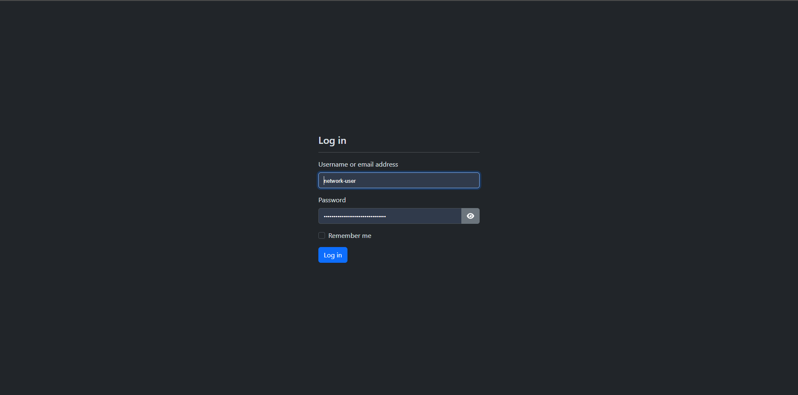

# Users

This portion of the documentation is meant for the end users of the OZDS web
application. This documentation outlines all functionality and features of the
OZDS web application divided for certain roles of users.

The [admin](docs/en/user/admin/index.md) portion describes all functionality and
features for administrators of the application. These are not considered end
users and are usually developers.

## Login

On the login page, users start their session. After logging in, the user is
redirected to a page personalized to their needs based on their user type,
privileges, and the locations and network users they are responsible for.

 _/login_
