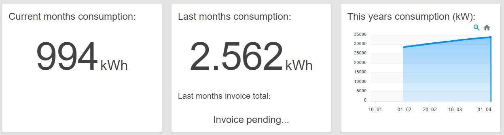
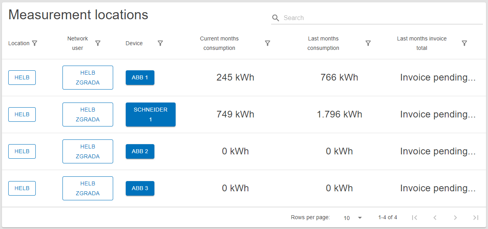

# Network user

  \page user-network-user Network user

The dahboard of a user selected to oversee network users.

## Navigation

[Invoices](../../user/shared/invoices/index.md)

[Measurement locations](../../user/shared/measurement-locations/index.md)

[Network users](../../user/shared/network-users/index.md)

## Content

 _/app_

## Network user Home Panel

This panel shows three segments displaying the combined values of current month
consumption, last month consumption with the last months total invoices under
that numer.

There is also a graph showing this years power consumption.

 _Network User
Home Panel_

## Measurement Location Table

This table shows all measurement locations the current user can oversee.

The user can see the name of the location, network user and device on that
measurement location. The current month consumption, last month consumption and
last months invoice total for thous measurement locations.

By pressing on the name of the location or network user, the user can inspect
that entities detailes.

Clicking on a device redirects to a detailed overview of individual measurement
locations.

_Measurement Locations Table_
