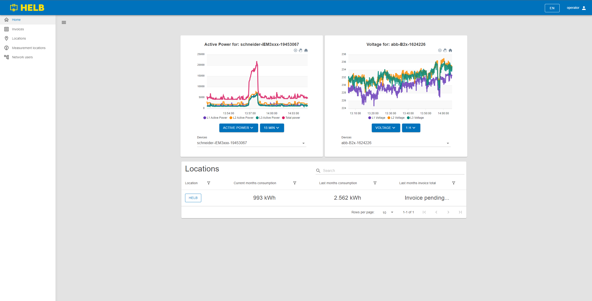
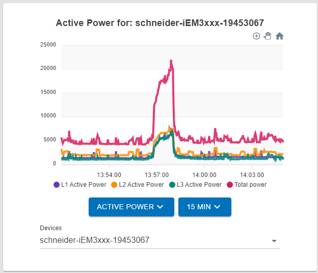

# Operator

The dahboard of a user selected to oversee all aspects of the network.

## Content

 _/app_

## Operator Graph

This graph shows a wide variety of data for any device in the whole network. By
changing the settings on each graph, it is possible to get an accurate overview
of the function of any device on the network.

There are two dropdown menus and an auto-completing text box.

The left dropdown allows the user to change what type of data they want to see.

The right dropdown allows the user to change the time scale of the data
visualization in steps of 15 minutes, 1 hour, 6 hours, and 24 hours.

The auto-completing text box labeled "Devices" allows the user to select which
device's data will be displayed.

 _Operator Graph_

## Locatio Table

This table shows all locations the current user can oversee.

The user can see the name of each location, its current month consumption, last
month consumption, and the last months invoice total.

By pressing on the name of the location, the user can inspect that locations
data.

 _Location Table_
