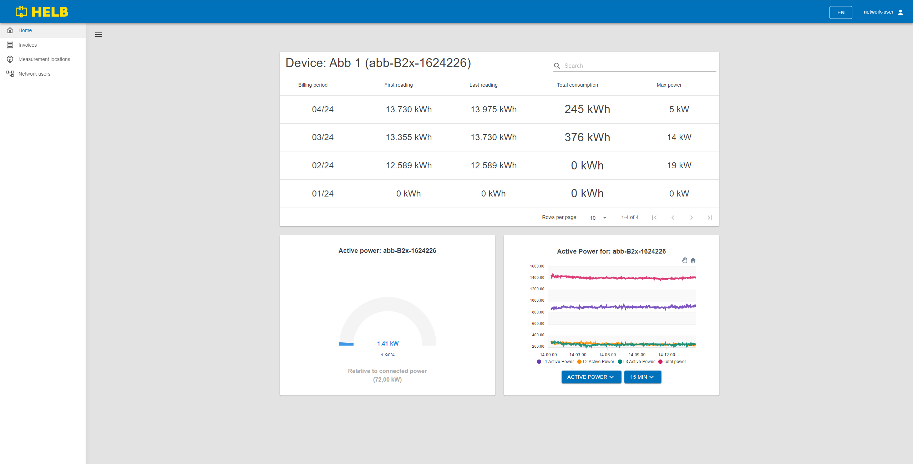
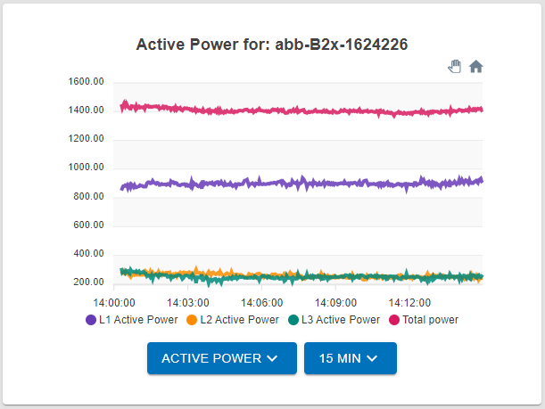
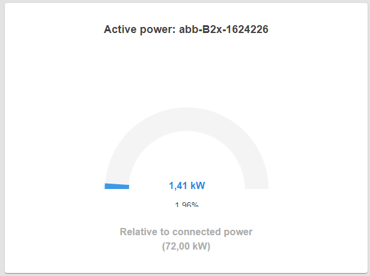

# Meter details

  \page user-shared-meter-details Meter details

The dahboard of a user selected to oversee all aspects of the network.

## Available to

[Operator](../../../user/operator/index.md)

[Location](../../../user/location/index.md)

[Network user](../../../user/network-user/index.md)

## Content

 _/app/meter/{id}_

## Meter Graph

This graph shows a wide variety of data for this specific device. By changing
the settings, it is possible to get an accurate overview of the function of this
device.

There are two dropdown menus.

The left dropdown allows the user to change what type of data they want to see.

The right dropdown allows the user to change the time scale of the data
visualization in steps of 15 minutes, 1 hour, 6 hours, and 24 hours.

This display updates in real time !

 _Meter Graph_

## Meter Gage

This gage shows the current active power in relation to the connected power
allowed by the device which is set by the operator.

This display updates in real time !

 _Meter Gage_
