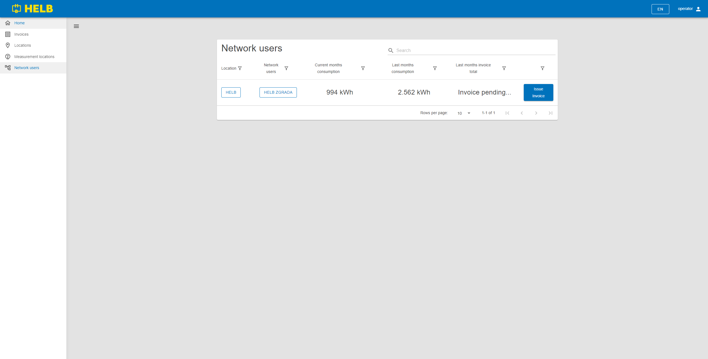
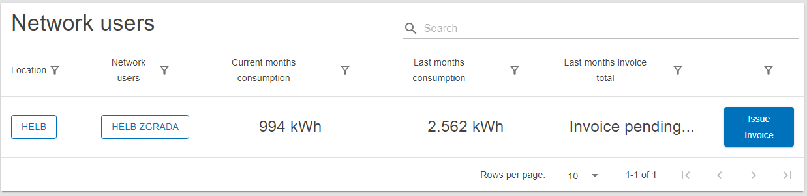

# Network users

  \page user-shared-network-users Network users

This page holds the Network users table component and is used to find and review
network users.

## Available to

[Operator](../../../user/operator/index.md)

[Location](../../../user/location/index.md)

[Network user](../../../user/network-user/index.md)

## Content

_/app/network-users_

## Network Users Table

This table shows all network users the current user can oversee.

The user can see the name of the location and the network user. The current
month consumption, last month consumption and last months invoice total for
thous network users.

By pressing on the name of the location or network user, the user can inspect
that entities detailes.

Clicking on the "Issue Invoice" button, the user generates an invoice between
the start of the month or the end of the last issued invoice to now. (Only
Operators can do this and no other users even see the button)

 _Network Users
Table_
