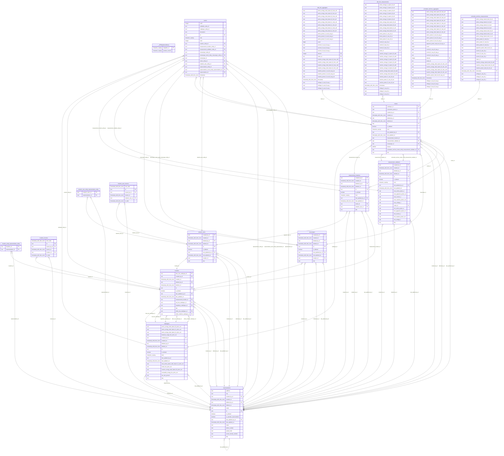

```mermaid
erDiagram
    __EFMigrationsHistory {
        character_varying migration_id PK
        character_varying product_version
    }

    abb_b2x_aggregates {
        real active_energy_total_export_t0_max_wh
        real active_energy_total_export_t0_min_wh
        real active_energy_total_import_t0_max_wh
        real active_energy_total_import_t0_min_wh
        real active_energy_total_import_t1_max_wh
        real active_energy_total_import_t1_min_wh
        real active_energy_total_import_t2_max_wh
        real active_energy_total_import_t2_min_wh
        real active_power_l1_net_t0_avg_w
        real active_power_l2_net_t0_avg_w
        real active_power_l3_net_t0_avg_w
        bigint count
        real current_l1_any_t0_avg_a
        real current_l2_any_t0_avg_a
        real current_l3_any_t0_avg_a
        integer interval PK
        text meter_id PK
        real reactive_energy_total_export_t0_max_varh
        real reactive_energy_total_export_t0_min_varh
        real reactive_energy_total_import_t0_max_varh
        real reactive_energy_total_import_t0_min_varh
        real reactive_power_l1_net_t0_avg_var
        real reactive_power_l2_net_t0_avg_var
        real reactive_power_l3_net_t0_avg_var
        timestamp_with_time_zone timestamp PK
        real voltage_l1_any_t0_avg_v
        real voltage_l2_any_t0_avg_v
        real voltage_l3_any_t0_avg_v
    }

    abb_b2x_measurements {
        real active_energy_l1_export_t0_wh
        real active_energy_l1_import_t0_wh
        real active_energy_l2_export_t0_wh
        real active_energy_l2_import_t0_wh
        real active_energy_l3_export_t0_wh
        real active_energy_l3_import_t0_wh
        real active_energy_total_export_t0_wh
        real active_energy_total_import_t0_wh
        real active_energy_total_import_t1_wh
        real active_energy_total_import_t2_wh
        real active_power_l1_any_t0_w
        real active_power_l2_any_t0_w
        real active_power_l3_any_t0_w
        real current_l1_any_t0_a
        real current_l2_any_t0_a
        real current_l3_any_t0_a
        text meter_id PK
        real reactive_energy_l1_export_t0_varh
        real reactive_energy_l1_import_t0_varh
        real reactive_energy_l2_export_t0_varh
        real reactive_energy_l2_import_t0_varh
        real reactive_energy_l3_export_t0_varh
        real reactive_energy_l3_import_t0_varh
        real reactive_energy_total_export_t0_varh
        real reactive_energy_total_import_t0_varh
        real reactive_power_l1_any_t0_var
        real reactive_power_l2_any_t0_var
        real reactive_power_l3_any_t0_var
        timestamp_with_time_zone timestamp PK
        real voltage_l1_any_t0_v
        real voltage_l2_any_t0_v
        real voltage_l3_any_t0_v
    }

    catalogues {
        real active_energy_total_import_t0_price_eur
        real active_energy_total_import_t1_price_eur
        real active_energy_total_import_t2_price_eur
        real business_usage_fee_price_eur
        text created_by_id FK
        timestamp_with_time_zone created_on
        text deleted_by_id FK
        timestamp_with_time_zone deleted_on
        text id PK
        boolean is_deleted
        character_varying kind
        text last_updated_by_id FK
        timestamp_with_time_zone last_updated_on
        real max_active_power_total_import_t1_price_eur
        real meter_fee_price_eur
        real reactive_energy_total_import_t0_price_eur
        real renewable_energy_fee_price_eur
        real tax_rate_percent
        text title
    }

    events {
        integer audit
        text auditable_entity_id
        text catalogue_entity_id FK
        text description
        text id PK
        character_varying kind
        integer level
        text location_entity_id FK
        text measurement_location_entity_id FK
        text measurement_validator_entity_id FK
        text messenger_entity_id FK
        text messenger_event_entity_messenger_entity_id FK
        text messenger_id FK
        text meter_entity_id FK
        text network_user_entity_id FK
        text representative_entity_id FK
        text representative_event_entity_representative_id FK
        text representative_id FK
        timestamp_with_time_zone timestamp
    }

    location_entity_representative_entity {
        text locations_id PK
        text representatives_id PK
    }

    location_invoices {
        timestamp_with_time_zone from_date
        text id PK
        text issued_by_id FK
        timestamp_with_time_zone issued_on
        text location_id FK
        timestamp_with_time_zone to_date
    }

    locations {
        text blue_low_catalogue_id FK
        text created_by_id FK
        timestamp_with_time_zone created_on
        text deleted_by_id FK
        timestamp_with_time_zone deleted_on
        text id PK
        boolean is_deleted
        text last_updated_by_id FK
        timestamp_with_time_zone last_updated_on
        text measurement_location_id FK
        text red_low_catalogue_id FK
        text regulatory_catalogue_id FK
        text title
        text white_low_catalogue_id FK
        text white_medium_catalogue_id FK
    }

    measurement_locations {
        text created_by_id FK
        timestamp_with_time_zone created_on
        text deleted_by_id FK
        timestamp_with_time_zone deleted_on
        text id PK
        boolean is_deleted
        character_varying kind
        text last_updated_by_id FK
        timestamp_with_time_zone last_updated_on
        text meter_id FK
        text network_user_id FK
        text title
    }

    measurement_validators {
        text created_by_id FK
        timestamp_with_time_zone created_on
        text deleted_by_id FK
        timestamp_with_time_zone deleted_on
        text id PK
        boolean is_deleted
        character_varying kind
        text last_updated_by_id FK
        timestamp_with_time_zone last_updated_on
        real max_active_power_w
        real max_apparent_power_va
        real max_current_a
        real max_reactive_power_var
        real max_voltage_v
        text meter_id FK
        real min_active_power_w
        real min_apparent_power_va
        real min_current_a
        real min_reactive_power_var
        real min_voltage_v
        text title
    }

    messengers {
        text created_by_id FK
        timestamp_with_time_zone created_on
        text deleted_by_id FK
        timestamp_with_time_zone deleted_on
        text id PK
        boolean is_deleted
        text last_updated_by_id FK
        timestamp_with_time_zone last_updated_on
        text location_id FK
        text title
    }

    meters {
        text catalogue_id FK
        real connection_power_w
        text created_by_id FK
        timestamp_with_time_zone created_on
        text deleted_by_id FK
        timestamp_with_time_zone deleted_on
        text id PK
        boolean is_deleted
        character_varying kind
        text last_updated_by_id FK
        timestamp_with_time_zone last_updated_on
        text measurement_location_id FK
        text measurement_validator_id FK
        text messenger_id FK
        ARRAY phases
        text schneideri_em3xxx_meter_entity_measurement_validator_id FK
        text title
    }

    network_user_entity_representative_entity {
        text network_users_id PK
        text representatives_id PK
    }

    network_user_invoices {
        timestamp_with_time_zone from_date
        text id PK
        text issued_by_id FK
        timestamp_with_time_zone issued_on
        text network_user_id FK
        timestamp_with_time_zone to_date
    }

    network_users {
        text created_by_id FK
        timestamp_with_time_zone created_on
        text deleted_by_id FK
        timestamp_with_time_zone deleted_on
        text id PK
        boolean is_deleted
        text last_updated_by_id FK
        timestamp_with_time_zone last_updated_on
        text location_id FK
        text title
    }

    representatives {
        text address
        text city
        text created_by_id FK
        timestamp_with_time_zone created_on
        text deleted_by_id FK
        timestamp_with_time_zone deleted_on
        text email
        text id PK
        boolean is_deleted
        boolean is_operator_representative
        text last_updated_by_id FK
        timestamp_with_time_zone last_updated_on
        text name
        text phone_number
        text postal_code
        text social_security_number
        text title
    }

    schneider_iem3xxx_aggregates {
        real active_energy_total_export_t0_max_wh
        real active_energy_total_export_t0_min_wh
        real active_energy_total_import_t0_max_wh
        real active_energy_total_import_t0_min_wh
        real active_energy_total_import_t1_max_wh
        real active_energy_total_import_t1_min_wh
        real active_energy_total_import_t2_max_wh
        real active_energy_total_import_t2_min_wh
        real active_power_l1_net_t0_avg_w
        real active_power_l2_net_t0_avg_w
        real active_power_l3_net_t0_avg_w
        real apparent_power_total_net_t0_avg_va
        bigint count
        real current_l1_any_t0_avg_a
        real current_l2_any_t0_avg_a
        real current_l3_any_t0_avg_a
        integer interval PK
        text meter_id PK
        real reactive_energy_total_export_t0_max_varh
        real reactive_energy_total_export_t0_min_varh
        real reactive_energy_total_import_t0_max_varh
        real reactive_energy_total_import_t0_min_varh
        real reactive_power_total_net_t0_avg_var
        timestamp_with_time_zone timestamp PK
        real voltage_l1_any_t0_avg_v
        real voltage_l2_any_t0_avg_v
        real voltage_l3_any_t0_avg_v
    }

    schneider_iem3xxx_measurements {
        real active_energy_export_total_t0_wh
        real active_energy_import_l1_t0_wh
        real active_energy_import_l2_t0_wh
        real active_energy_import_l3_t0_wh
        real active_energy_import_total_t0_wh
        real active_energy_import_total_t1_wh
        real active_energy_import_total_t2_wh
        real active_power_l1_net_t0_w
        real active_power_l2_net_t0_w
        real active_power_l3_net_t0_w
        real apparent_power_total_net_t0_va
        real current_l1_any_t0_a
        real current_l2_any_t0_a
        real current_l3_any_t0_a
        text meter_id PK
        real reactive_energy_export_total_t0_varh
        real reactive_energy_import_total_t0_varh
        real reactive_power_total_net_t0_var
        timestamp_with_time_zone timestamp PK
        real voltage_l1_any_t0_v
        real voltage_l2_any_t0_v
        real voltage_l3_any_t0_v
    }

    abb_b2x_aggregates }o--|| meters : "meter_id"
    abb_b2x_measurements }o--|| meters : "meter_id"
    catalogues }o--|| representatives : "created_by_id"
    catalogues }o--|| representatives : "deleted_by_id"
    catalogues }o--|| representatives : "last_updated_by_id"
    events }o--|| catalogues : "catalogue_entity_id"
    locations }o--|| catalogues : "blue_low_catalogue_id"
    locations }o--|| catalogues : "red_low_catalogue_id"
    locations }o--|| catalogues : "regulatory_catalogue_id"
    locations }o--|| catalogues : "white_low_catalogue_id"
    locations }o--|| catalogues : "white_medium_catalogue_id"
    meters }o--|| catalogues : "catalogue_id"
    events }o--|| locations : "location_entity_id"
    events }o--|| measurement_locations : "measurement_location_entity_id"
    events }o--|| measurement_validators : "measurement_validator_entity_id"
    events }o--|| messengers : "messenger_entity_id"
    events }o--|| messengers : "messenger_event_entity_messenger_entity_id"
    events }o--|| meters : "messenger_id"
    events }o--|| meters : "meter_entity_id"
    events }o--|| network_users : "network_user_entity_id"
    events }o--|| representatives : "representative_entity_id"
    events }o--|| representatives : "representative_event_entity_representative_id"
    events }o--|| representatives : "representative_id"
    location_entity_representative_entity }o--|| locations : "locations_id"
    location_entity_representative_entity }o--|| representatives : "representatives_id"
    location_invoices }o--|| locations : "location_id"
    location_invoices }o--|| representatives : "issued_by_id"
    locations }o--|| measurement_locations : "measurement_location_id"
    locations }o--|| representatives : "created_by_id"
    locations }o--|| representatives : "deleted_by_id"
    locations }o--|| representatives : "last_updated_by_id"
    messengers }o--|| locations : "location_id"
    network_users }o--|| locations : "location_id"
    measurement_locations }o--|| meters : "meter_id"
    measurement_locations }o--|| network_users : "network_user_id"
    measurement_locations }o--|| representatives : "created_by_id"
    measurement_locations }o--|| representatives : "deleted_by_id"
    measurement_locations }o--|| representatives : "last_updated_by_id"
    meters }o--|| measurement_locations : "measurement_location_id"
    measurement_validators }o--|| meters : "meter_id"
    measurement_validators }o--|| representatives : "created_by_id"
    measurement_validators }o--|| representatives : "deleted_by_id"
    measurement_validators }o--|| representatives : "last_updated_by_id"
    meters }o--|| measurement_validators : "measurement_validator_id"
    meters }o--|| measurement_validators : "schneideri_em3xxx_meter_entity_measurement_validator_id"
    messengers }o--|| representatives : "created_by_id"
    messengers }o--|| representatives : "deleted_by_id"
    messengers }o--|| representatives : "last_updated_by_id"
    meters }o--|| messengers : "messenger_id"
    meters }o--|| representatives : "created_by_id"
    meters }o--|| representatives : "deleted_by_id"
    meters }o--|| representatives : "last_updated_by_id"
    schneider_iem3xxx_aggregates }o--|| meters : "meter_id"
    schneider_iem3xxx_measurements }o--|| meters : "meter_id"
    network_user_entity_representative_entity }o--|| network_users : "network_users_id"
    network_user_entity_representative_entity }o--|| representatives : "representatives_id"
    network_user_invoices }o--|| network_users : "network_user_id"
    network_user_invoices }o--|| representatives : "issued_by_id"
    network_users }o--|| representatives : "created_by_id"
    network_users }o--|| representatives : "deleted_by_id"
    network_users }o--|| representatives : "last_updated_by_id"
    representatives }o--|| representatives : "created_by_id"
    representatives }o--|| representatives : "deleted_by_id"
    representatives }o--|| representatives : "last_updated_by_id"
```