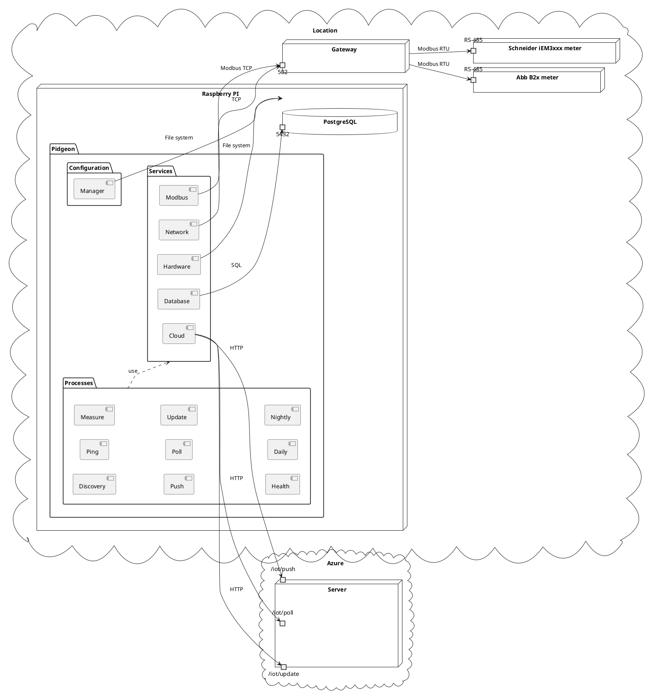

# IOT

## Pidgeon

Pidgeon is a Raspberry Pi-based application designed to fetch and manage
electrical billing data from various sites. It's a crucial component in an
electrical distribution network, facilitating the collection and transmission of
meter data.

### Key Features

- **Meter Discovery**: Pidgeon automatically discovers meters it recognizes on
  the site's network.
- **Health Checks**: Regular pings and health checks ensure the meters and
  Pidgeon itself are functioning correctly.
- **Data Collection**: Workers are started to take electrical measurements at a
  high frequency to ensure accurate and up-to-date data.
- **Local Storage**: Measurements are stored in a locally installed PostgreSQL
  database, serving as an outbox before the data is sent to the server.
- **Server Communication**: Pidgeon sends the measurements to the server and
  polls the server for any edited configuration.
- **Tariff Setting**: Pidgeon is also responsible for setting the daily and
  nightly tariffs of the meters.

By optimizing for the frequency of measurement, Pidgeon ensures the most
accurate and current data is always available. This data is crucial for
generating accurate billing information and providing valuable data for research
and analysis.

## Architecture

The architecture of Pidgeon is designed to efficiently collect and manage
electrical billing data. The diagram below provides a visual representation of
the system's architecture.

In the context of a location, there are various types of meters, such as the Abb
B2x meter and the Schneider iEM3xxx meter, which are connected via RS-485. The
Gateway, accessible via port 502, serves as an intermediary for data
communication.

The Raspberry Pi hosts the Pidgeon application, which is divided into three main
packages: Configuration, Services, and Processes.

- **Configuration**: This package contains the Manager component, responsible
  for managing the application's configuration.
- **Services**: This package contains several service components:
  - **Hardware**: Interacts with the physical hardware of the Raspberry Pi.
  - **Network**: Manages network communications.
  - **Modbus**: Handles the Modbus protocol for communication with the meters.
  - **Database**: Manages the local PostgreSQL database.
  - **Cloud**: Handles communication with the cloud server.
- **Processes**: This package contains various processes that Pidgeon runs:
  - **Discovery**: Discovers meters on the network.
  - **Ping**: Regularly checks the health of the meters.
  - **Measure**: Takes electrical measurements from the meters.
  - **Health**: Checks the health of Pidgeon and stores it in the local
    database.
  - **Push**: Sends measurements to the cloud server.
  - **Poll**: Polls the cloud server for configuration updates.
  - **Update**: Updates the server of meter and Raspberry PI health.
  - **Daily**: Sets the daily tariff of the meters.
  - **Nightly**: Sets the nightly tariff of the meters.

Please refer to the diagram for a visual representation of these components and
their interactions.

## Environment

This document outlines the development environment requirements for this
project. These requirements are necessary to execute the commands defined in the
`justfile`.

### Requirements

- **Rust**: The project uses Rust, and the `cargo` command is used for building,
  testing, and running the Rust code. It's also used for generating
  documentation and formatting the Rust code.
- **Docker**: Docker is used to manage services that the application depends on.
  The `docker compose up -d` command is used to start these services, and
  `docker compose down -v` is used to stop them.

### Optional Requirements

The following tools are optional for some workflows but recommended for
development:

#### Probe

- **Python**: Python is used for the `probe` script. You need to have Python
  installed to run this script.
- **Poetry**: Poetry is used for managing Python dependencies.

#### Formatting

- **Yapf**: Yapf is used for formatting Python code in the project.
- **Prettier**: Prettier is used for formatting and checking the format of the
  code in the project.
- **shfmt**: shfmt is used for formatting shell scripts in the project.

#### Linting

- **ShellCheck**: ShellCheck is used for linting shell scripts.
- **cspell**: cspell is used for spell checking in the project.
- **Ruff**: Ruff is used for checking Rust code in the project.
- **Clippy**: Clippy is a Rust linter that's used in the project.
- **Pyright**: Pyright is used for type checking Python code.

#### Documentation

- **mdbook**: mdbook is used for building the documentation.

### Development Workflow

The development workflow is managed by `just`, a command runner that's similar
to `make`. The `justfile` at the root of the repository defines various commands
for building, testing, running, and managing the project.

Here are the steps to set up the development environment and use `just`:

1. **Install Dependencies**: Install all the required tools listed in this
   chapter.

2. **Prepare the Environment**: Run `just prepare` to install Python
   dependencies, start Docker services, and run database migrations.

3. **Run the Application**: Use `just run` to run the application. You can pass
   arguments to the application by appending them to the command, like
   `just run --arg`.

4. **Run the Probe Script**: Use `just probe` to run the probe script. You can
   pass arguments to the script in the same way as the run command.

5. **Format the Code**: Use `just format` to format the code in the project
   using various formatters.

6. **Lint the Code**: Use `just lint` to lint the code in the project using
   various linters.

7. **Test the Code**: Use `just test` to run the tests for the project.

8. **Build the Project**: Use `just build` to build the project. This will
   create a release build of the project and move the output to the `artifacts`
   directory.

9. **Generate Documentation**: Use `just docs` to generate the project's
   documentation. This will build the documentation and move the output to the
   `artifacts` directory.

Remember to run `just prepare` whenever you pull new changes from the
repository, to ensure your environment is up-to-date.

## Installation

The installation of Pidgeon involves several steps, each of which is detailed on
its own page. Here's an overview of the process:

1. **Generate Secrets**: A script in the repository uses `sops` and `openssl` to
   generate secrets for a specific Raspberry Pi. This step is crucial for
   securing communication between the device and the server.

2. **Create ISO Image**: Another script in the repository uses `nix build` to
   create an ISO image for the device. This image contains the Pidgeon
   application and all its dependencies.

3. **Inject Secret key**: The secret key generated in step 1 is injected into
   the image using a script in the repository. The secret key is used to decrypt
   the secrets generated in step 1 during boot.

4. **Assemble the Device**: The ISO image is flashed onto a 1TB SSD. The SSD is
   then plugged into a USB port of the Raspberry Pi, and the power USB-C cable
   is plugged in.
