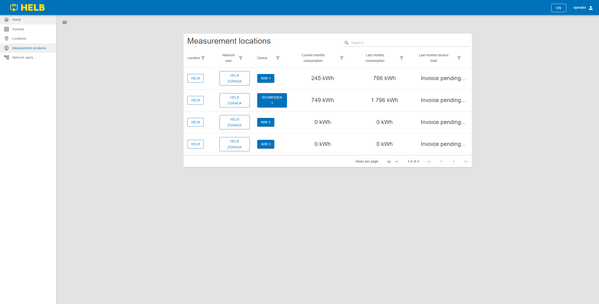
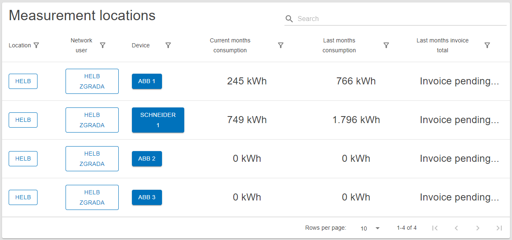

# Measurement locations

This page holds the Measurement locations table component and is used to find
and review measurement locations.

## Content

_/app/meters_

## Network Users Table

This table shows all measurement locations the current user can oversee.

The user can see the name of the location, network user and device on that
measurement location. The current month consumption, last month consumption and
last months invoice total for thous measurement locations.

By pressing on the name of the location or network user, the user can inspect
that entities details.

Clicking on a device redirects to a detailed overview of individual measurement
locations.

_Measurement Locations Table_
