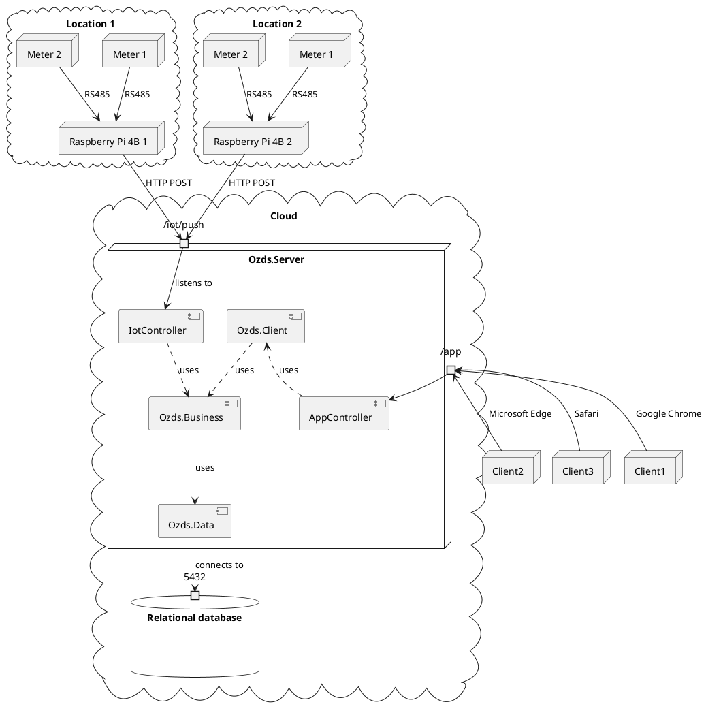

# Architecture

The architecture of OZDS is a distributed system with multiple locations. The
system consists of a server running the ASP.NET Core application, a PostgreSQL
database, and multiple locations with meters. The meters are connected to the
server via a Raspberry Pi acting as a messenger. The server receives data from
the meters and stores it in the database. The server also serves the web
application to clients.

The server hosts the ASP.NET Core application, which is divided into three main
parts:

- **Ozds.Data**: Data access layer
- **Ozds.Client**: Client application
- **Ozds.Business**: Business logic

Here is the full deployment graph for OZDS:

