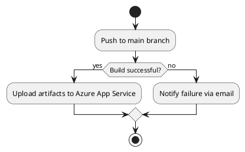
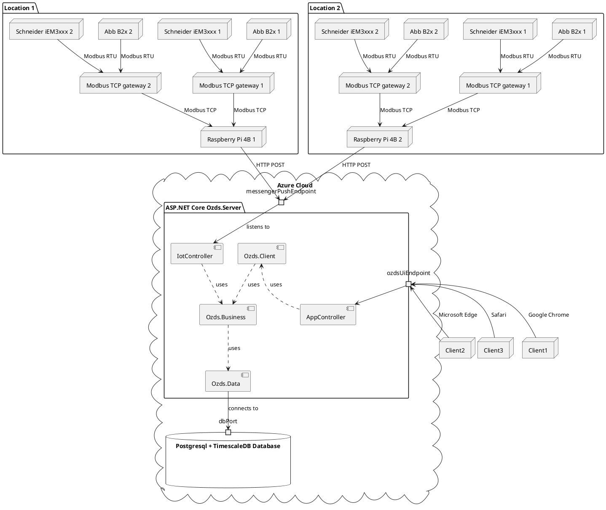

# Environment

OZDS is an ASP.NET Core web application hosted on Azure App Service. The
application connects to a Postgresql database with TimescaleDB extension. The
application listens for incoming data from Raspberry Pi 4B devices via HTTP POST
requests. Users access the application via a web browser. The application is
rendered via Blazor SSR.

## Development

Tools used to develop OZDS are:

- [dotnet](https://github.com/dotnet/core/blob/main/release-notes/8.0/8.0.1/8.0.1.md?WT.mc_id=dotnet-35129-website)
- [just](https://github.com/casey/just#packages)
- [docker](https://docs.docker.com/engine/install/)
- [node](https://nodejs.org/en/download)
- [dvc](https://dvc.org/)
- [git](https://git-scm.com/)
- [nushell](https://www.nushell.sh/)

Code for the server is hosted on [github](https://github.com/altibiz/ozds). The
code is developed in [vscode](https://code.visualstudio.com/).

Code for the Raspberry Pi 4B messengers is also hosted on
[github](https://github.com/altibiz/ozds). Code for these devices is usually
developed by connecting to them via SSH. Messengers are running on a linux
distribution called NixOS. The reasoning behind this is that NixOS makes it is
easy to reproduce the same environment on all devices.

## Deployment

Deployment is done via github actions. The deployment workflow is defined in
`.github/workflows/deploy.yml`. The workflow is triggered on push to the `main`
branch. The workflow builds the OZDS web application and uploads it to an Azure
App Service.

## Architecture

The architecture of OZDS is a distributed system with multiple locations. The
system consists of a server running the ASP.NET Core application, a PostgreSQL
database, and multiple locations with meters. The meters are connected to the
server via a Raspberry Pi acting as a messenger. The server receives data from
the meters and stores it in the database. The server also serves the web
application to clients.

The server hosts the ASP.NET Core application, which is divided into three main
parts:

- **Ozds.Data**: Data access layer
- **Ozds.Client**: Client application
- **Ozds.Business**: Business logic

Here is the full deployment graph for OZDS:

