# Ozds.Business

This project contains all of the backend logic of the server. Critical functions
in this project is tested in the `Ozds.Business.Test` project. Logic is divided
into namespaces conceptually similar to each other (ie. all logic regarding
conversion is in the Conversion namespace).

For each namespace an `Abstractions` namespace is present which contains
interfaces that should be used in consuming code. If there is a `Agnostic`
namespace it should be used instead because it automatically handles logic for
picking the right implementation of the interface. For example, the
`AgnosticModelEntityConverter` will pick the right implementation of
`IModelEntityConverter` based on the type of the entity or model.

## Ozds.Business.Aggregation

This namespace contains client-side and server-side aggregation upsert logic.
The server-side logic is used to tell the database how to upsert aggregates via
LINQ Expressions over database entities and the client-side logic mimics this as
a method over business models . If we were just to use the server-side logic,
the database would complain that it couldn't upsert the same aggregate twice in
the same transaction. This is why we have to upsert first on client-side the
aggregates that are to be inserted and then upsert the aggregates that are on
the server.

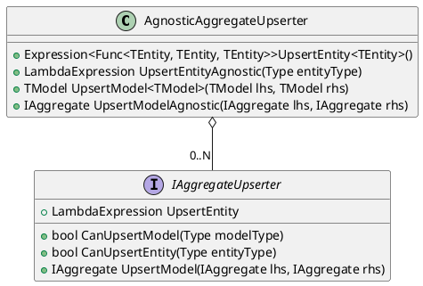

## Ozds.Business.Capabilities

This namespace is a WIP but will be used to detect which meter measures which
measures.

## Ozds.Business.Conversion

This namespace contains converters for:

- Database entities &harr; business models

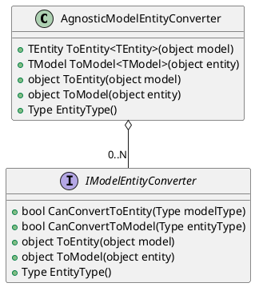

- Push requests &harr; measurement models

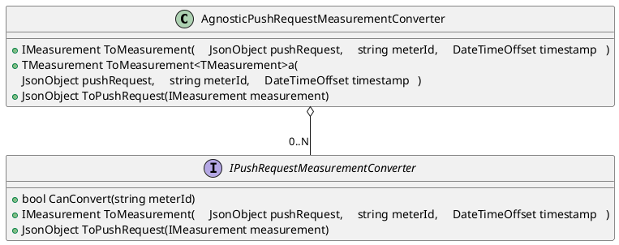

- Measurement models &rarr; aggregate models

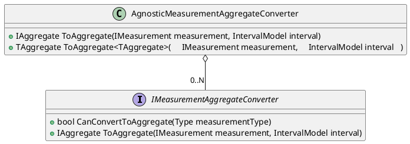

## Ozds.Business.Finance

This namespace contains billing logic. There are three levels of billing
calculations needed for every invoice:

- Invoice level: this is the top level corresponding to a network user or
  location and uses lower levels to calculate the totals and subtotals on an
  invoice

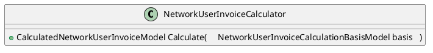

- Calculation level: each invoice has a set of calculation corresponding to a
  measurement location and uses the lowest level to calculate the totals and
  subtotals of a particular calculation

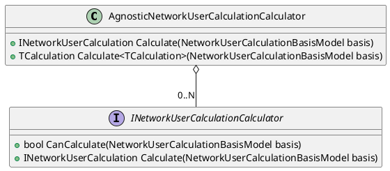

- Calculation item level: each calculation has a set of calculation items
  corresponding to a certain billing item and calculates the amounts and totals
  of a particular billing item

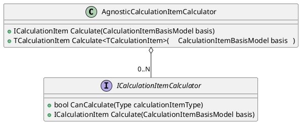

For now, only network user invoice calculation is implemented.

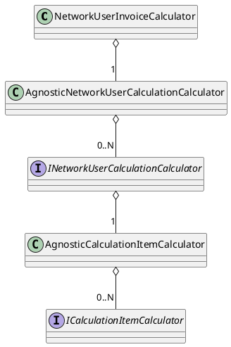

## Ozds.Business.Interceptors

This namespace contains interceptors to any request sent to the database and
implement various business logic:

- `AggregateCreationInterceptor`: intercepts any request to the database
  containing measurements and creates aggregates for them.
- `AuditingInterceptor`: intercepts any request to the database that mutates
  entities that are auditable, mutates their audit fields and creates an audit
  event depending on the type of mutation done on the entity.
- `CascadingSoftDeleteInterceptor`: this interceptor is a WIP but it is meant to
  implement soft delete logic for auditable entities.
- `InvoiceIssuingInterceptor`: intercepts any invoice creation request and
  mutates the issuing fields on that invoice.
- `ReadonlyInterceptor`: throws an exception any time an attempt to mutate a
  readonly entity is made.
- `ServedSaveChangesInterceptors`: this is a base type for interceptors that is
  hooked up to provide inheritors with a `IServiceProvider`.

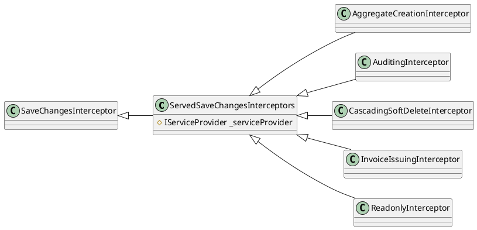

## Ozds.Business.Iot

Contains logic for handling IoT requests. It only handles pushing for now
(`OzdsIotHandler`), but it will be split into a `Push` and `Poll` interface once
we get around to implement polling.

Pushing is the process of IoT devices sending measurements to the server. It is
implemented via a REST API that the IoT devices can call. The IoT devices send
measurements which then get aggregated and stored in the database.

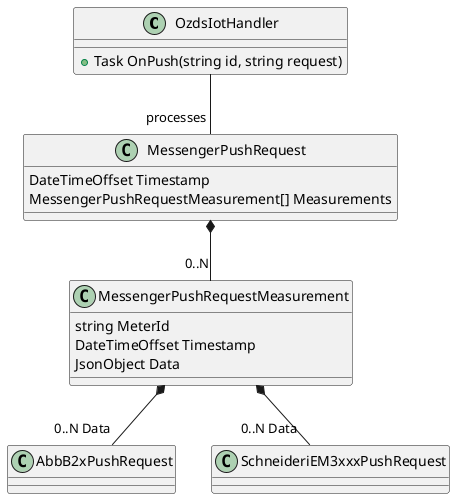

Polling is the process of IoT devices asking the server for newly updated
configuration. This way we bypass the need to send anything to IoT devices which
is problematic in todays internet because of technologies like CGNAT. It is
meant to be implemented as a REST API that the IoT devices can call. The IoT
devices asks for updated configuration and the server responds with the updated
configuration from the database.

## Ozds.Business.Math

Contains logic for manipulating electrical measures. This is a critical part of
the application that much of the application depends on and is tested
thoroughly.

There are three different dimensions each measure can have:

- Phase: a measure can be a single phase or triphasic measure.

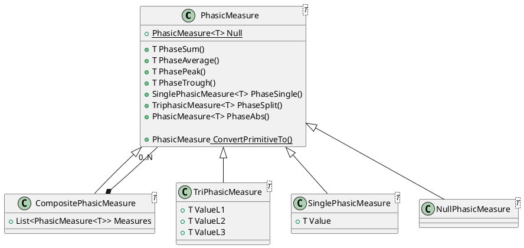

- Direction: a measure can be an import or export measure and these correspond
  to user consumption and production. It can also be any duplex measure if it is
  a measure of current or voltage since these are not directional.

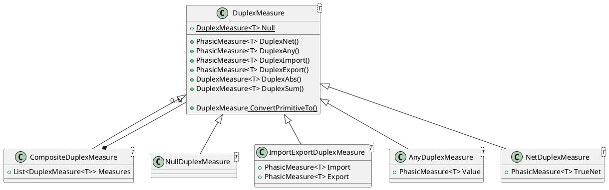

- Tariff: a measure can be a high tariff and a low tariff or a single tariff
  measure. This is used to calculate the cost of the measure depending on the
  time of day.

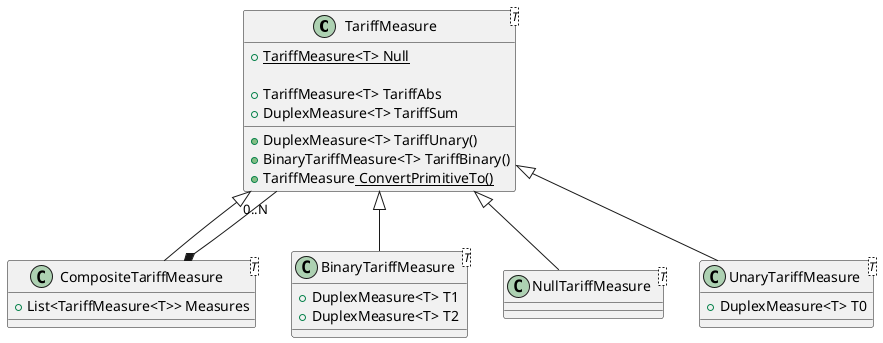

The measure structure is such that the tariff hierarchy classes contain
directional hierarchy classes which contain phase hierarchy classes. All three
of these class hierarchies also contain a null class which is used to represent
a measure that is not set. These hierarchies also contain a composite class
which is used to represent a measure that is a combination of two or more
measures. This is used to represent the different ways in which a measure is
stored or calculated for better accuracy. For example, we might store a measure
as three phases but also as a single phase and for some calculations one is more
accurate than the other.

There are two more top-level class hierarchies:

- Span: a measure can be a measure over a certain time span. This is used to
  calculate the costs over a span of time.

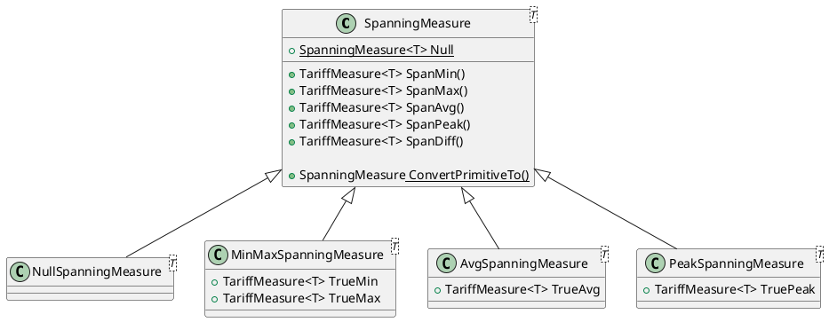

- Expenditure: a measure can be an amount used to calculate costs. For network
  user invoice calculations this means it can be either used to calculate supply
  or usage costs and is used to represent these two different types of costs.

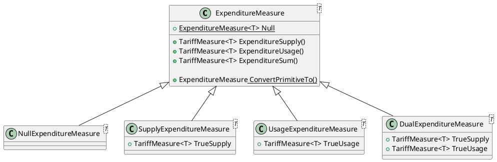

## Ozds.Business.Models

Contains business models that are used to represent entities in the database.
Entities in the database are represented as entity classes in the
`Ozds.Data.Entities` namespace which are then converted to business models in
this namespace. The reasoning is that the database entity classes have special
fields or properties that instruct Entity Framework Core how to handle database
operations that should not be exposed to the rest of the application. On the
other hand, business models have special fields and properties and implement
interfaces which should not be represented in the database.

There are a couple of marker interfaces that are used to represent the different
aspects of models:

- Identifiable: models with an identifier. Additionally, all models that are
  identifiable should have a title which is a nice addition to display them in
  the UI.

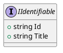

- Readonly: models that are readonly and should not be mutated.

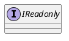

Models are divided into a few of class hierarchies:

- Auditable: models that can be audited. Any time a mutation is done on an
  auditable entity, an audit event is created and the audit fields on the entity
  are updated.

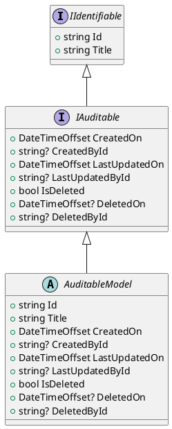

- Events: models that represent events like when an auditable entity is mutated.

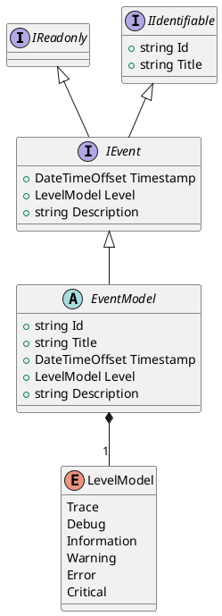

- Measurements: models that represent measurements that are sent by IoT devices.
  In order to use models from multiple device types all measurement models are
  required to implement the different measure properties on `IMeasurement`.

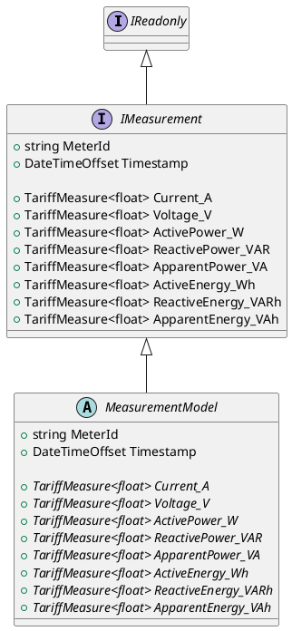

- Aggregates: models that represent aggregates of measurements. In order to use
  models from multiple device types all aggregate models are required to
  implement the different measure properties on `IAggregate`. The `Timestamp` is
  always the start of the span of the aggregate. The `Count` is the number of
  measurements that were aggregated. The non `SpanningMeasure` energy properties
  are the values of the last measurement in the span while the non
  `SpanningMeasure` non energy properties are the average values of the
  measurements in the span.

```plantuml
@startuml

interface IReadonly

interface IAggregate
{
  + string MeterId
  + DateTimeOffset Timestamp
  + IntervalModel Interval
  + long Count

  + TariffMeasure<float> Current_A
  + TariffMeasure<float> Voltage_V
  + TariffMeasure<float> ActivePower_W
  + TariffMeasure<float> ReactivePower_VAR
  + TariffMeasure<float> ApparentPower_VA
  + TariffMeasure<float> ActiveEnergy_Wh
  + TariffMeasure<float> ReactiveEnergy_VARh
  + TariffMeasure<float> ApparentEnergy_VAh

  + SpanningMeasure<float> ActiveEnergySpan_Wh
  + SpanningMeasure<float> ReactiveEnergySpan_VARh
  + SpanningMeasure<float> ApparentEnergySpan_VAh
}

abstract class AggregateModel
{
  + string MeterId
  + DateTimeOffset Timestamp
  + IntervalModel Interval
  + long Count

  + {abstract} TariffMeasure<float> Current_A
  + {abstract} TariffMeasure<float> Voltage_V
  + {abstract} TariffMeasure<float> ActivePower_W
  + {abstract} TariffMeasure<float> ReactivePower_VAR
  + {abstract} TariffMeasure<float> ApparentPower_VA
  + {abstract} TariffMeasure<float> ActiveEnergy_Wh
  + {abstract} TariffMeasure<float> ReactiveEnergy_VARh
  + {abstract} TariffMeasure<float> ApparentEnergy_VAh

  + {abstract} SpanningMeasure<float> ActiveEnergySpan_Wh
  + {abstract} SpanningMeasure<float> ReactiveEnergySpan_VARh
  + {abstract} SpanningMeasure<float> ApparentEnergySpan_VAh
}

IReadonly <|-- IAggregate
IAggregate <|-- AggregateModel

@enduml
```

- Invoices: models that represent invoices that are sent to network users.

```plantuml
@startuml

interface IReadonly

interface IIdentifiable
{
  + string Id
  + string Title
}

interface IInvoice
{
  + DateTimeOffset IssuedOn
  + string? IssuedById
  + DateTimeOffset FromDate
  + DateTimeOffset ToDate
  + decimal Total_EUR
  + decimal Tax_EUR
  + decimal TotalWithTax_EUR
}

abstract class InvoiceModel
{
  + string Id
  + string Title
  + DateTimeOffset IssuedOn
  + string? IssuedById
  + DateTimeOffset FromDate
  + DateTimeOffset ToDate
  + decimal Total_EUR
  + decimal Tax_EUR
  + decimal TotalWithTax_EUR
}

IReadonly <|-- IInvoice
IIdentifiable <|-- IInvoice
IInvoice <|-- InvoiceModel

@enduml
```

- Calculations: models that represent calculations that are used to calculate
  the totals and subtotals on an invoice.

```plantuml
@startuml

interface IReadonly

interface IIdentifiable
{
  + string Id
  + string Title
}

interface ICalculation
{
  + DateTimeOffset IssuedOn
  + string? IssuedById
  + DateTimeOffset FromDate
  + DateTimeOffset ToDate
  + string MeterId
  + IMeter Meter
  + decimal Total_EUR
}

abstract class CalculationModel
{
  + string Id
  + string Title
  + DateTimeOffset IssuedOn
  + string? IssuedById
  + DateTimeOffset FromDate
  + DateTimeOffset ToDate
  + string MeterId
  + IMeter ArchivedMeter
  + decimal Total_EUR
}

IReadonly <|-- ICalculation
IIdentifiable <|-- ICalculation
ICalculation <|-- CalculationModel

@enduml
```

In addition, all class hierarchies implement `IValidatableObject`.

## Ozds.Business.Mutations

Contains classes that wrap database requests in functions that mutate data.
These are separate from other requests in `Ozds.Business.Queries` because
mutations are always more sensitive and should be handled with care. All the
classes use `AgnosticModelEntityConverter` from `Ozds.Business.Conversion` to
convert the mutated business models to database entities and `DataDbContext`
from `Ozds.Data` to mutate data in the database.

Most mutations are done via agnostic classes that operate on class hierarchies
in `Ozds.Business.Models`:

- Auditable: mutations that mutate auditable entities.

```plantuml
@startuml

class OzdsAuditableMutations
{
  - DataDbContext _context
  - AgnosticModelEntityConverter _modelEntityConverter

  + void Create(IAuditable)
  + void Update(IAuditable)
  + void Delete(IAuditable)
}

@enduml
```

- Events: mutations that mutate events. This class hierarchy is readonly so only
  the create mutation is implemented.

```plantuml
@startuml

class OzdsEventMutations
{
  - DataDbContext _context
  - AgnosticModelEntityConverter _modelEntityConverter

  + void Create(IEvent)
}

@enduml
```

- Measurements: mutations that mutate measurements. This class hierarchy is
  readonly so only the create mutation is implemented.

```plantuml
@startuml

class OzdsMeasurementMutations
{
  - DataDbContext _context
  - AgnosticModelEntityConverter _modelEntityConverter

  + void Create(IMeasurement)
}

@enduml
```

- Aggregates: mutations that mutate aggregates. This class hierarchy is readonly
  so only the create mutation is implemented.

```plantuml
@startuml

class OzdsAggregateMutations
{
  - DataDbContext _context
  - AgnosticModelEntityConverter _modelEntityConverter

  + void Create(IAggregate)
}

@enduml
```

- Invoices: mutations that mutate invoices. This class hierarchy is readonly so
  only the create mutation is implemented.

```plantuml
@startuml

class OzdsInvoiceMutations
{
  - DataDbContext _context
  - AgnosticModelEntityConverter _modelEntityConverter

  + void Create(IInvoice)
}

@enduml
```

- Calculations: mutations that mutate calculations. This class hierarchy is
  readonly so only the create mutation is implemented.

```plantuml
@startuml

class OzdsCalculationMutations
{
  - DataDbContext _context
  - AgnosticModelEntityConverter _modelEntityConverter

  + void Create(ICalculation)
}

@enduml
```

## Ozds.Business.Queries

Contains classes that wrap database requests in functions that query data. These
are separate from other requests in `Ozds.Business.Mutations` because queries
are always less sensitive and should be handled with less care. All the classes
use `DataDbContext` from `Ozds.Data` to query data in the database and
`AgnosticModelEntityConverter` from `Ozds.Business.Conversion` to convert the
queried database entities to business models.

Query classes use the `PaginatedList<T>` class that makes it easier to paginate
the results of a query.

```plantuml
@startuml

class PaginatedList<T>
{
  + List<T> Items
  + int TotalCount
}

@enduml
```

Query classes also use the `Z.EntityFramework.Plus.EFCore` nuget package to make
where and order by clauses agnostic over the type of entity. This makes the code
more brittle but for now it is a quick and dirty solution to get started before
we convert everything to use standard LINQ expressions.

Most queries are done via specifically implemented classes but a lot can be
queried via agnostic classes that operate on class hierarchies in
`Ozds.Business.Models`:

- Auditable: queries that query auditable entities.

```plantuml
@startuml

class OzdsAuditableQueries
{
  - DataDbContext _context
  - AgnosticModelEntityConverter _modelEntityConverter

  + Task<T?> ReadSingle<T>(string id) where T : class, IAuditable
  + Task<PaginatedList<T>> Read<T>( \
    IEnumerable<string> whereClauses, \
    IEnumerable<string> orderByDescClauses, \
    IEnumerable<string> orderByAscClauses, \
    int pageNumber = QueryConstants.StartingPage, \
    int pageCount = QueryConstants.DefaultPageCount \
  ) where T : class, IAuditable
}

@enduml
```

- Events: queries that query events.

```plantuml
@startuml

class OzdsEventQueries
{
  - DataDbContext _context
  - AgnosticModelEntityConverter _modelEntityConverter

  + public async Task<PaginatedList<T>> Read<T>( \
    IEnumerable<string> whereClauses, \
    DateTimeOffset fromDate, \
    DateTimeOffset toDate, \
    int pageNumber = QueryConstants.StartingPage, \
    int pageCount = QueryConstants.DefaultPageCount \
  ) where T : class, IEvent
}

@enduml
```

- Measurements: queries that query measurements.

```plantuml
@startuml

class OzdsMeasurementQueries
{
  - DataDbContext _context
  - AgnosticModelEntityConverter _modelEntityConverter

  + Task<PaginatedList<T>> Read<T>( \
    IEnumerable<string> whereClauses, \
    DateTimeOffset fromDate, \
    DateTimeOffset toDate, \
    int pageNumber = QueryConstants.StartingPage, \
    int pageCount = QueryConstants.DefaultPageCount \
  ) where T : class, IMeasurement
}

@enduml
```

- Aggregates: queries that query aggregates.

```plantuml
@startuml

class OzdsAggregateQueries
{
  - DataDbContext _context
  - AgnosticModelEntityConverter _modelEntityConverter

  + Task<PaginatedList<T>> Read<T>( \
    IEnumerable<string> whereClauses, \
    DateTimeOffset fromDate, \
    DateTimeOffset toDate, \
    int pageNumber = QueryConstants.StartingPage, \
    int pageCount = QueryConstants.DefaultPageCount \
  ) where T : class, IAggregate
}

@enduml
```

- Invoices: queries that query invoices.

```plantuml
@startuml

class OzdsInvoiceQueries
{
  - DataDbContext _context
  - AgnosticModelEntityConverter _modelEntityConverter

  + Task<T?> ReadSingle<T>(string id) where T : class, IInvoice
  + Task<PaginatedList<T>> Read<T>( \
    IEnumerable<string> whereClauses, \
    IEnumerable<string> orderByDescClauses, \
    IEnumerable<string> orderByAscClauses, \
    int pageNumber = QueryConstants.StartingPage, \
    int pageCount = QueryConstants.DefaultPageCount \
  ) where T : class, IInvoice
}

@enduml
```

- Calculations: queries that query calculations.

```plantuml
@startuml

class OzdsCalculationQueries
{
  - DataDbContext _context
  - AgnosticModelEntityConverter _modelEntityConverter

  + Task<T?> ReadSingle<T>(string id) where T : class, ICalculation
  + Task<PaginatedList<T>> Read<T>( \
    IEnumerable<string> whereClauses, \
    IEnumerable<string> orderByDescClauses, \
    IEnumerable<string> orderByAscClauses, \
    int pageNumber = QueryConstants.StartingPage, \
    int pageCount = QueryConstants.DefaultPageCount \
  ) where T : class, ICalculation
}

@enduml
```

## Ozds.Business.Time

Contains all logic for handling time. This is a critical part of the application
that much of the application depends on and is tested thoroughly.
