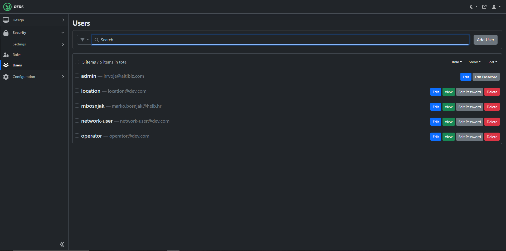

# Admin

The administrator can change some app settings and modify users.

## Users

On this interface, all aspects of users can be modified, new users can be
created, or existing ones can be deleted. These users are later linked to
representatives of network users and locations.

 _/admin/users_
