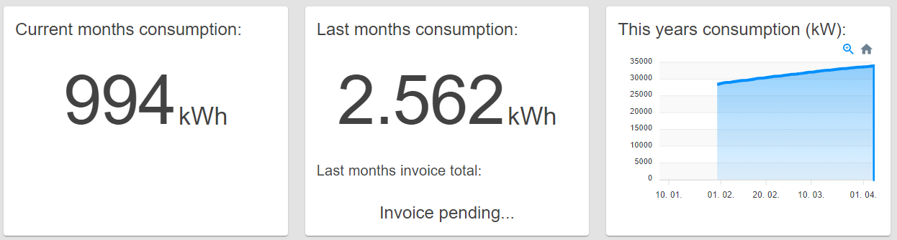

# Network user

The dashboard for a user selected to oversee network users.

## Content

_/app_

## Network user Home Panel

This panel displays three segments showing the combined values of current
month's consumption, last month's consumption, and last month's total invoices.

There is also a graph showing this year's power consumption.

_Network User Home Panel_

## Measurement Location Table

This table shows all measurement locations the current user can oversee.

The user can see the name of the location, network user, and device at each
measurement location. The table also displays the current month's consumption,
last month's consumption, and last month's invoice total for those measurement
locations.

By clicking on the name of the location or network user, the user can inspect
the details of that entity.

Clicking on a device redirects to a detailed overview of individual measurement
locations.

_Measurement Locations Table_
