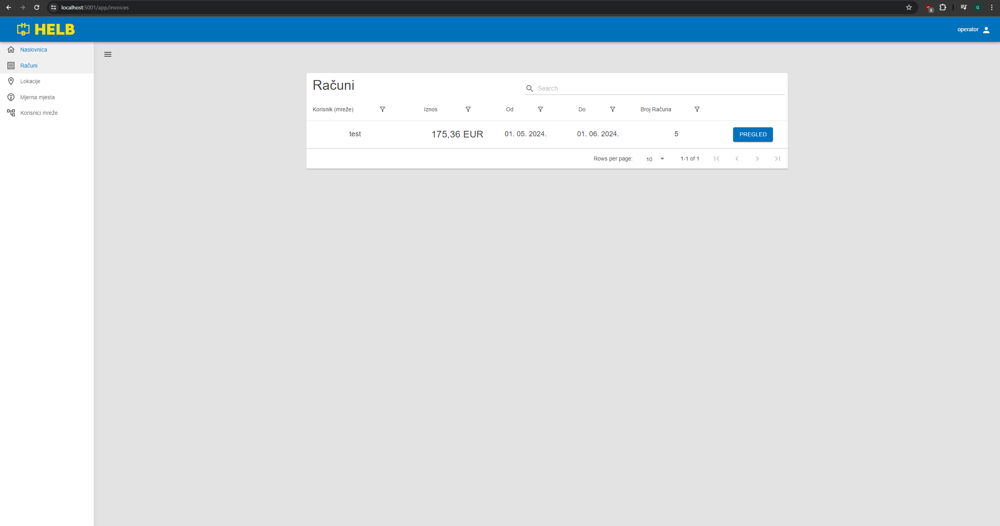
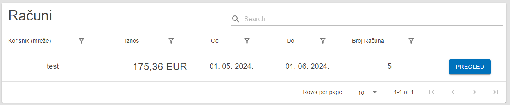

# Invoices

This page holds the Invoices table and is used to find and review invoices.

## Content

 _/app/invoices_

## Invoices Table

This table shows all invoices the current user can oversee.

The user can see the name of the network user this invoice is directed at, the
total amount in EUR, the start and end time of the billing period, and the
invoice number.

By pressing the inspect button, the user can see a more detailed overview of the
invoice and even print it out.

 _Invoices Table_
