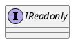
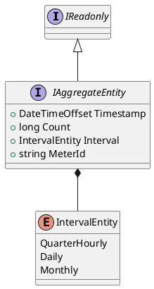
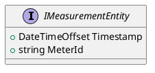
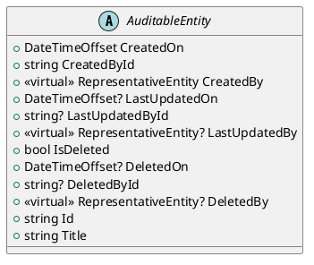
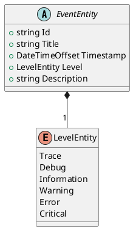
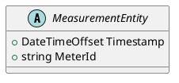
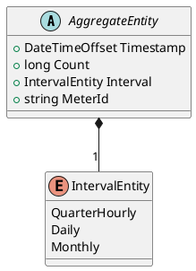
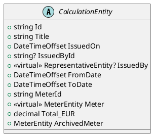
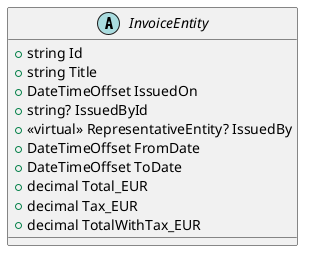

# Ozds.Data

This project contains all entities and queries for the database. The entities
are kept in the `Entities` namespace and queries are functions in the
`OzdsDbClient` class. The class is partial and it is divided into conceptually
similar files (ie. all queries for meters are in the OzdsDbClientMeters.cs
file).

## Schema

[The schema](../../schema.md) is generated using `mermerd` when it is migrated
to the latest migration generated by `dotnet ef`.

## Ozds.Data.Entities

Contains entities that are used to represent tables in the database.

There are a couple of marker interfaces that are used to implement certain
functionality or interceptors in `Ozds.Business`:

- Readonly: marker interface used to implement read-only entities by throwing
  exceptions on mutations

- Aggregate: marker interface used to implement measurement aggregation. For now
  measurements are aggregated in quarter-hourly, daily and monthly intervals.

- Measurement: marker interface used to implement aggregations over
  measurements.

Apart from the marker interfaces, entities can be grouped in a few class
hierarchies. Virtual properties on entity classes are navigation properties to
other entities they have a relationship with and are not kept in the database.
These hierarchies make it easier to group entities that have similar mapping to
database tables:

- Auditable: entities that can be audited. These entities also have soft delete
  functionality implemented via interceptors.

- Event: entities that represent events.

- Measurements: entities that represent measurements. Concrete measurement types
  have navigation properties to specific meter types.

- Aggregates: entities that represent aggregated measurements. The timestamp is
  the start of the interval and the count is the number of measurements in that
  interval. Concrete aggregate types have navigation properties to specific
  meter types.

- Calculations: entities that represent calculations. Calculations that don't
  have a issuer are issued automatically by the server.

- Invoices: entities that represent invoices.

## Ozds.Data.Migrations

This namespace contains generated migrations for the database. The migrations
are generated using `dotnet ef` and are kept in the `Migrations` directory.
