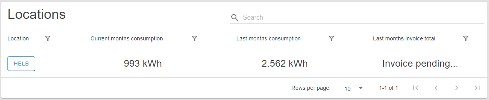

# Location

The dashboard of a user selected to oversee locations.

## Content

 _/app_

## Location Home Panel

This panel shows three segments displaying the combined values of current month
consumption, last month consumption, and current power consumption.

 _Location Home
Panel Component_

## Location Table

This table shows all locations the current user can oversee.

The user can see the name of each location, its current month consumption, last
month consumption, and current power consumption for each location.

By pressing on the name of the location, the user can inspect that locations
data.

 _Location Table_
