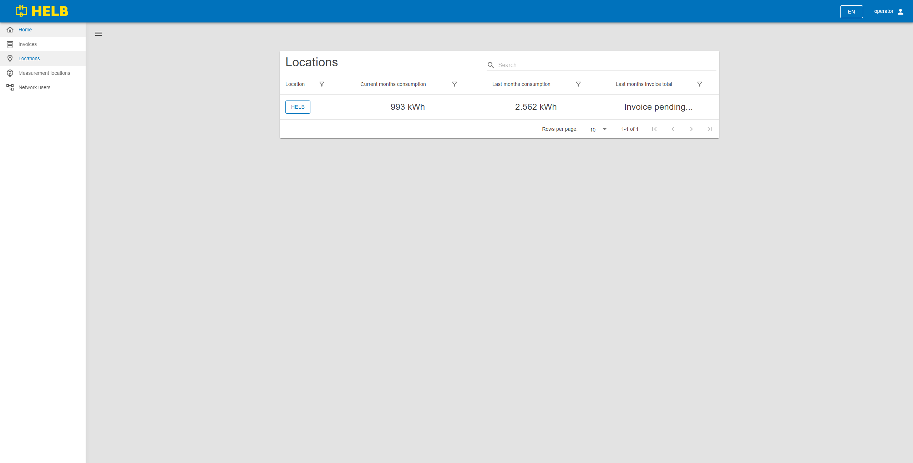

# Locations

This page holds the Locations table component and is used to find and review
locations.

## Content

 _/app/locations_

## Locations Table

This table shows all locations the current user can oversee.

The user can see the name of each location, its current month consumption, last
month consumption, and the last months invoice total.

By pressing on the name of the location, the user can inspect that locations
data.

 _Locations Table_
