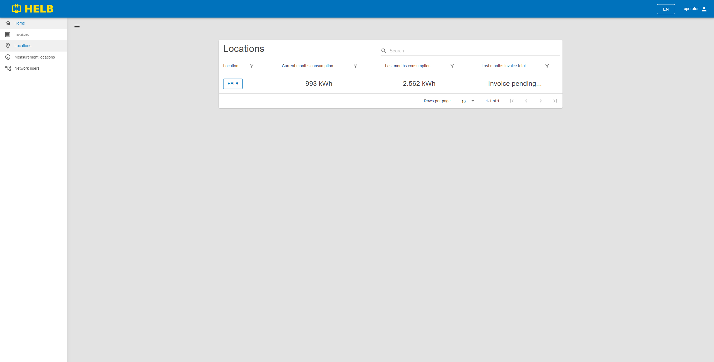

# Locations

This page contains the Locations table and is used to find and review locations.

## Content

 _/app/locations_

## Locations Table

This table shows all locations.

The user can see the name of each location, its current month's consumption,
last month's consumption, and last month's invoice total.

By clicking on the name of the location, the user can inspect that location's
data.

 _Locations Table_
