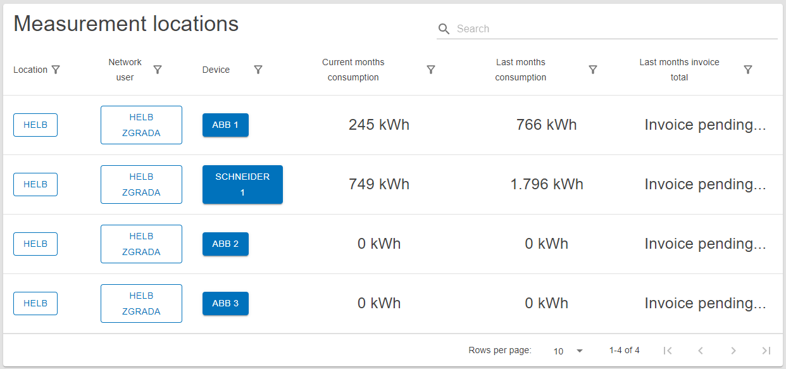

# Measurement locations

This page contains the Measurement Locations table and is used to find and
review measurement locations.

## Content

_/app/meters_

## Network Users Table

This table shows all measurement locations the current user can see.

The user can see the name of the location, network user, and device at that
measurement location. The table also displays the current month's consumption,
last month's consumption, and last month's invoice total for those measurement
locations.

By clicking on the name of the location or network user, the user can inspect
the details of that entity.

Clicking on a device redirects to a detailed overview of individual measurement
locations.

_Measurement Locations Table_
