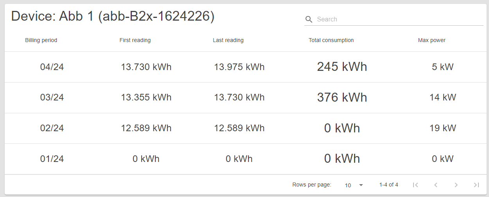

# Meter details

This page shows detailed stats for the selected meter with real-time displays.

## Content

 _/app/meter/{id}_

## Meter Table

This table shows important data about the meter organized by billing period.

The user can see the billing period, first and last reading, total consumption
for that billing period, and the maximum power measured within that billing
period.

 _Meter Table_

## Meter Graph

This graph shows various data for this specific device. By changing the
settings, users can get an accurate overview of the device's function.

There are two dropdown menus.

The left dropdown allows the user to select the type of data they want to see.

The right dropdown allows the user to change the time scale of the data
visualization in steps of 15 minutes, 1 hour, 6 hours, and 24 hours.

This display updates in real time!

 _Meter Graph_

## Meter Gauge

This gauge shows the current active power compared to the connected power
allowed by the device, which is set by the operator.

This display updates in real time !

 _Meter Gauge_
