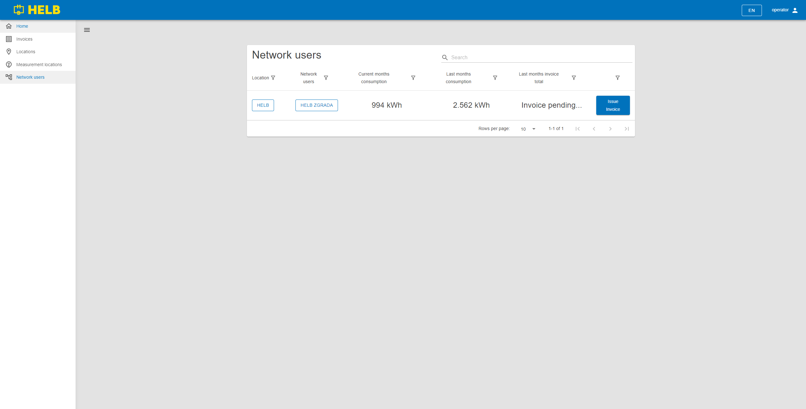
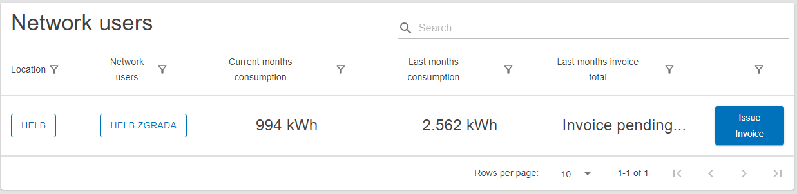

# Network users

This page contains the Network Users table and is used to find and review
network users.

## Content

 _/app/network-users_

## Network Users Table

This table shows all network users the current user can see.

The user can see the name of the location and the network user, as well as the
current month's consumption, last month's consumption, and last month's invoice
total for those network users.

By clicking on the name of the location or network user, the user can inspect
the details of that entity.

Clicking on the "Issue Invoice" button allows the user to generate an invoice
from the start of the month or the end of the last issued invoice to now. (Only
Operators can do this, and no other users can see the button.)

 _Network Users
Table_
