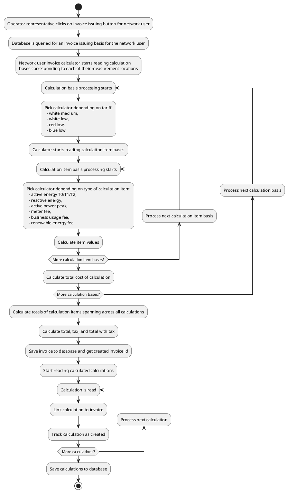

# Billing

Billing is the process of issuing invoices to network users and locations. Only
network user billing is currently implemented. Currently, operators can issue
invoices on demand for the last billing period (last month).

Billing is implemented via a set of classes that calculate different parts of
the invoice depending on measurement locations and tariffs.

