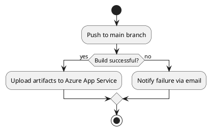

# Deployment

Deployment is done via github actions. The deployment workflow is defined in
`.github/workflows/deploy.yml`. The workflow is triggered on push to the `main`
branch. The workflow builds the OZDS web application and uploads it to an Azure
App Service.

