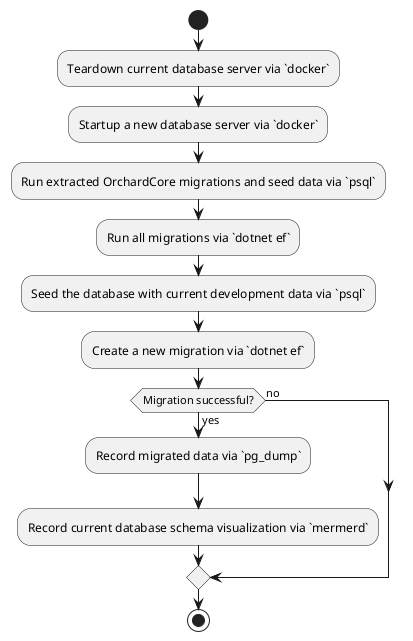

# Migration

Migrations are generated via `dotnet ef` but to prepare the database and test if
migrations went well, there is a bit more to do.

```plantuml
@startuml

start

:Teardown current database server via `docker`;

:Startup a new database server via `docker`;

:Run extracted OrchardCore migrations and seed data via `psql`;

:Run all migrations via `dotnet ef`;

:Seed the database with current development data via `psql`;

:Create a new migration via `dotnet ef`;

if (Migration successful?) then (yes)
  :Record migrated data via `pg_dump`;

  :Record current database schema visualization via `mermerd`;
else (no)
endif

stop

@enduml
```
