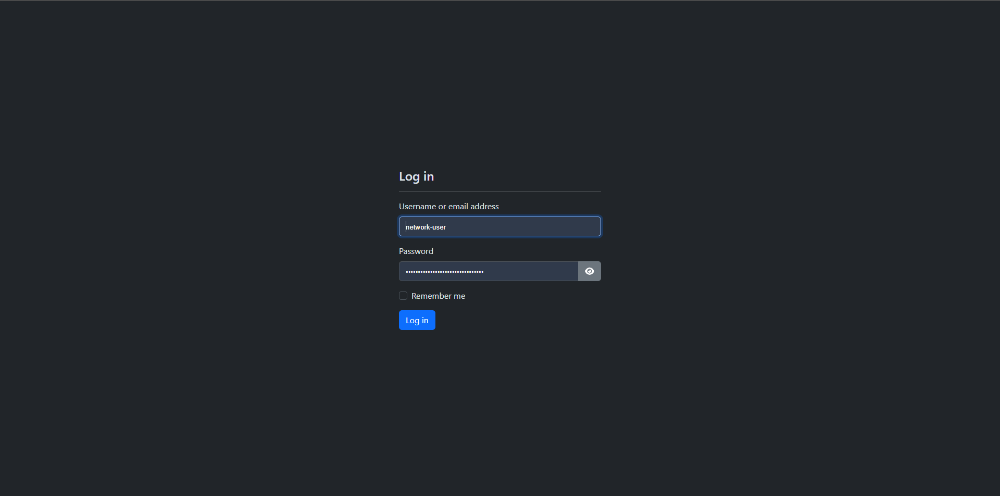

# Korisnici

Ovaj dio dokumentacije namijenjen je krajnjim korisnicima OZDS web aplikacije.
Ova dokumentacija opisuje sve funkcionalnosti i značajke OZDS web aplikacije
podijeljene prema određenim ulogama korisnika.

Dio [admin](admin/index.md) opisuje sve funkcionalnosti i značajke za
administratore aplikacije. Oni se ne smatraju krajnjim korisnicima i obično su
developeri.

## Prijava

Na stranici za prijavu, korisnici započinju svoju sesiju. Nakon prijave,
korisnik je preusmjeren na stranicu personaliziranu prema njihovim potrebama,
temeljem vrste korisnika, privilegija te lokacija i korisnika mreže za koje su
odgovorni.

 _/login_
