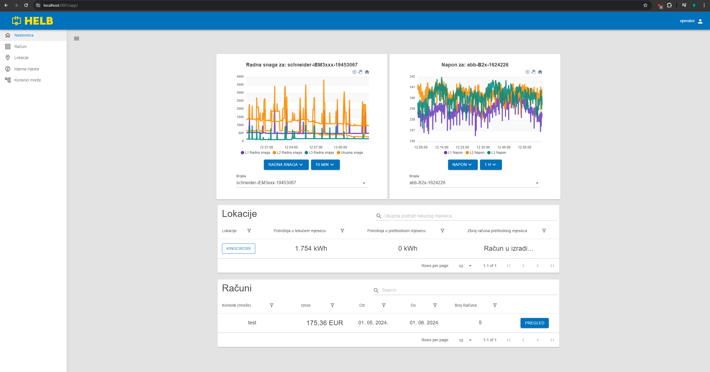
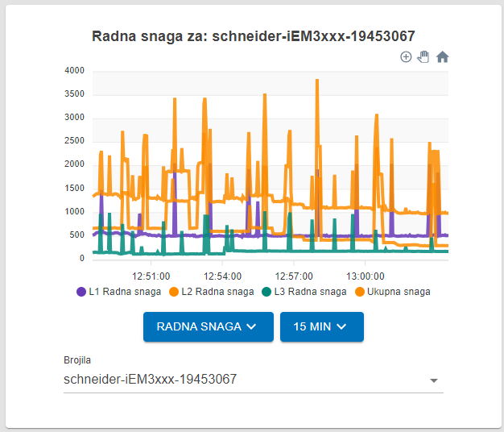

# Operator

Nadzorna ploča za korisnika odabranog za nadgledanje svih aspekata mreže.

## Sadržaj

_/app_

## Operator Graf

Ovaj graf prikazuje razne podatke za bilo koji uređaj u mreži. Promjenom
postavki na svakom grafu, korisnici mogu dobiti točan pregled funkcije bilo
kojeg uređaja u mreži.

Postoje dva padajuća izbornika i tekstualni okvir s automatskim dovršavanjem.

Lijevi padajući izbornik omogućuje korisniku odabir vrste podataka koje želi
vidjeti.

Desni padajući izbornik omogućuje korisniku promjenu vremenskog razmaka
vizualizacije podataka u koracima od 15 minuta, 1 sat, 6 sati i 24 sata.

Tekstualni okvir s automatskim dovršavanjem označen "Brojila" omogućuje
korisniku odabir podataka kojeg će uređaja biti prikazani.

 _Operator Graf_

## Tablica lokacija

Ova tablica prikazuje sve lokacije koje trenutni korisnik može nadgledati.

Korisnik može vidjeti ime svake lokacije, potrošnju u tekućem mjesecu, potrošnju
u prethodnom mjesecu i zbroj računa za prethodni mjesec.

Klikom na ime lokacije, korisnik može pregledati podatke te lokacije.

 _Tablica lokacija_
