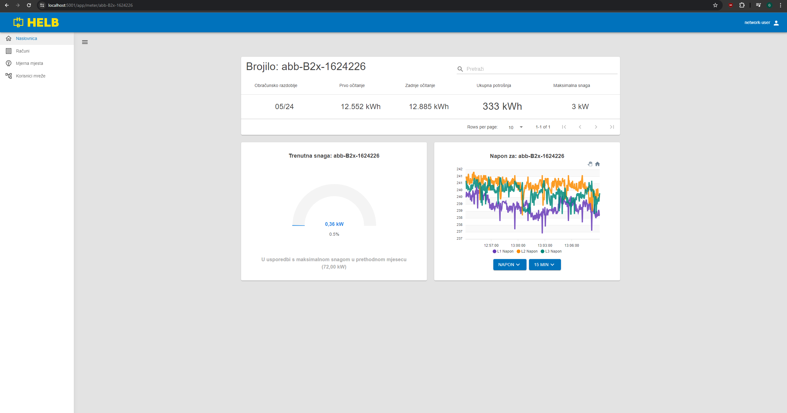
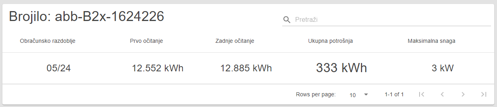
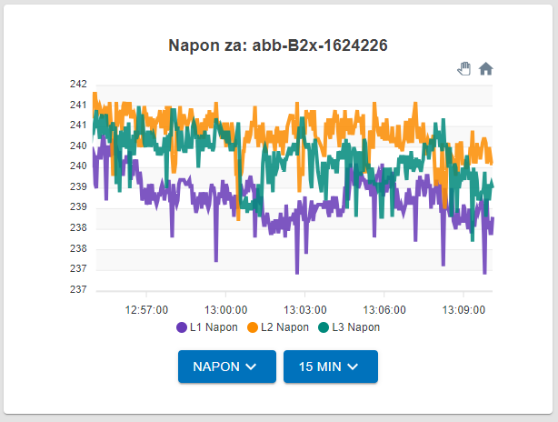
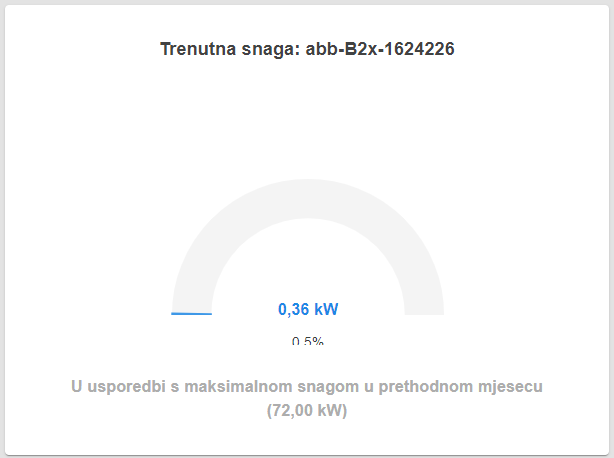

# Detalji brojila

Ova stranica prikazuje detaljne statistike za odabrano brojilo s prikazima u
stvarnom vremenu.

## Sadržaj

_/app/meter/{id}_

## Tablica brojila

Ova tablica prikazuje važne podatke o brojilu organizirane po obračunskom
razdoblju.

Korisnik može vidjeti obračunsko razdoblje, prvo i zadnje očitanje, ukupnu
potrošnju za to obračunsko razdoblje i maksimalnu snagu izmjerenu u tom
obračunskom razdoblju.

 _Tablica s
detaljima brojila_

## Graf brojila

Ovaj graf prikazuje razne podatke za ovo specifično brojilo. Promjenom postavki,
korisnici mogu dobiti točan pregled funkcije brojila.

Postoje dva padajuća izbornika.

Lijevi padajući izbornik omogućuje korisniku odabir vrste podataka koje želi
vidjeti.

Desni padajući izbornik omogućuje korisniku promjenu vremenskog razmaka
vizualizacije podataka u koracima od 15 minuta, 1 sat, 6 sati i 24 sata.

Ovaj prikaz se ažurira u stvarnom vremenu!

 _Graf brojila_

## Mjerač brojila

Ovaj mjerač prikazuje trenutnu aktivnu snagu u usporedbi s priključenom snagom
koju omogućuje brojilo, a koju postavlja operater.

Ovaj prikaz se ažurira u stvarnom vremenu!

 _Mjerač brojila_
