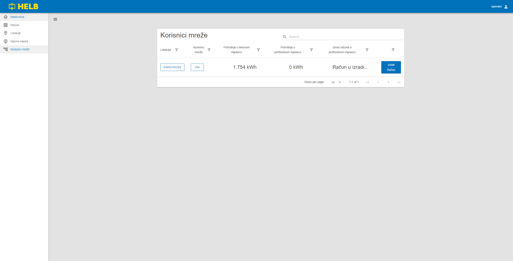
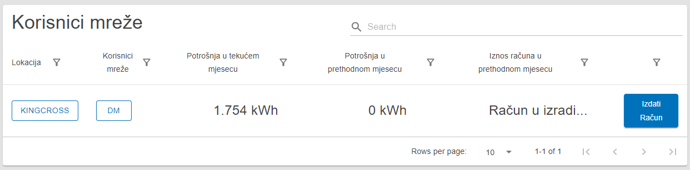

# Korisnici mreže

Ova stranica sadrži tablicu korisnika mreže i koristi se za pronalaženje i
pregled korisnika mreže.

## Sadržaj

_/app/network-users_

## Tablica korisnika mreže

Ova tablica prikazuje sve korisnike mreže koje trenutni korisnik može vidjeti.

Korisnik može vidjeti ime lokacije i korisnika mreže, kao i potrošnju u tekućem
mjesecu, potrošnju u prethodnom mjesecu i zbroj računa za prethodni mjesec za te
korisnike mreže.

Klikom na ime lokacije ili korisnika mreže, korisnik može pregledati detalje te
entitete.

Klikom na gumb "Izradi račun" korisnik može generirati račun od početka mjeseca
ili kraja zadnjeg izdanog računa do sada. (Samo operateri mogu to učiniti, i
nijedan drugi korisnik ne može vidjeti taj gumb.)

 _Tablica
korisnika mreže_
