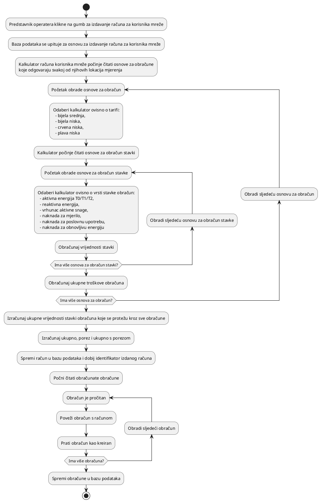

# Backend

Backend OZDS-a je ASP.NET Core web aplikacija. Podijeljena je u pakete:

- `Ozds.Server`: početni projekt
- `Ozds.Data`: sloj pristupa podacima
- `Ozds.Business`: poslovni sloj
- `Ozds.Client`: sloj korisničkog sučelja

Poslovni sloj je odgovoran za rukovanje administrativnim zadacima u web
aplikaciji. Sljedeći odjeljci objašnjavaju potrebne radnje za obavljanje
administrativnih zadataka.

## Naplata

Naplata je proces kreacije računa korisnicima mreže i lokacijama. Trenutno je
implementirana samo naplata korisnika mreže. Trenutno, operateri mogu izdati
račune na zahtjev za zadnje razdoblje naplate (prošli mjesec).

Naplata je implementirana putem skupa klasa koje izračunavaju različite dijelove
računa ovisno o lokacijama mjerenja i tarifama.

