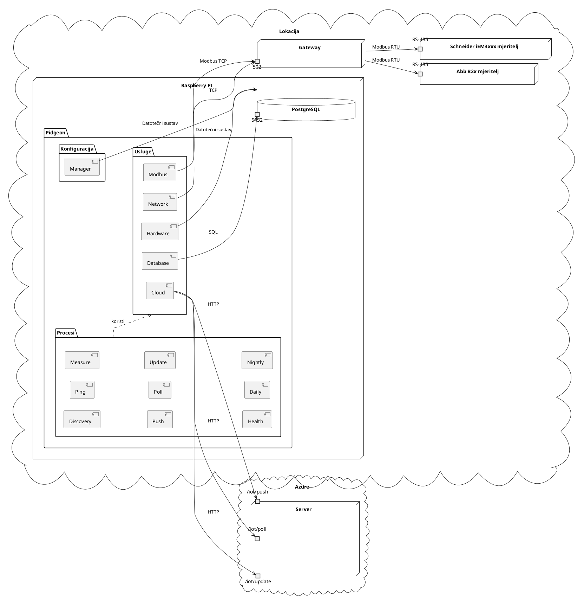

# IOT

Uređaji Raspberry PI 4 (posrednici) sadrže Rust program koji kontinuirano čita
mjerenja s mjerača, grupira ih svakim određenim intervalom i šalje ih na cloud
server.

Rust program se pokreće putem Systemd servisa koji radi na NixOS-u. Servis je
konfiguriran da se pokrene pri pokretanju sustava i ponovno pokrene u slučaju
neuspjeha. Mjerenja se pohranjuju u lokalno instaliranu Postgresql bazu podataka
s TimescaleDB ekstenzijom.

## Pidgeon

Pidgeon je aplikacija bazirana na Raspberry Pi-u dizajnirana za prikupljanje i
upravljanje podacima o električnom napajanju s različitih lokacija. To je
ključna komponenta u mreži za distribuciju električne energije, koja omogućuje
prikupljanje i prijenos podataka iz mjernih uređaja.

### Ključne značajke

- **Otkriće mjernih uređaja**: Pidgeon automatski otkriva mjerne uređaje koje
  prepoznaje na mreži lokacije.
- **Provjere stanja**: Redoviti pingovi i provjere stanja osiguravaju ispravno
  funkcioniranje mjernih uređaja i samog Pidgeona.
- **Prikupljanje podataka**: Pozadinski procesi započinju uzimanje električnih
  mjerenja visoke frekvencije kako bi osigurali točne i aktualne podatke.
- **Lokalno pohranjivanje**: Mjerenja se pohranjuju u lokalno instaliranu
  PostgreSQL bazu podataka, koja služi kao buffer prije slanja podataka na
  poslužitelj.
- **Komunikacija s poslužiteljem**: Pidgeon šalje mjerenja na poslužitelj i
  provjerava ima li ikakvih izmjena u konfiguraciji na poslužitelju.
- **Postavljanje tarifa**: Pidgeon je također odgovoran za postavljanje dnevnih
  i noćnih tarifa mjernih uređaja.

Optimiziranjem frekvencije mjerenja, Pidgeon osigurava najtočnije i najnovije
podatke. Ovi podaci su ključni za generiranje točnih informacija o naplati i
pružanje vrijednih podataka za istraživanje i analizu.

## Arhitektura

Arhitektura Pidgeona dizajnirana je za učinkovito prikupljanje i upravljanje
podacima o električnom napajanju. Dijagram ispod pruža vizualni prikaz
arhitekture sustava.

U kontekstu jedne lokacije postoje različiti tipovi brojila, kao što su Abb B2x
brojilo i Schneider iEM3xxx brojilo, koji su povezani putem RS-485. Gateway,
dostupan putem porta 502, služi kao posrednik za komunikaciju podataka.

Raspberry Pi pokreće Pidgeon aplikaciju, koja je podijeljena na tri glavna
paketa: Konfiguracija, Usluge i Procesi.

- **Konfiguracija**: Ovaj paket sadrži komponentu Manager, odgovornu za
  upravljanje konfiguracijom aplikacije.
- **Usluge**: Ovaj paket sadrži nekoliko servisnih komponenti:
  - **Hardware**: Interagira s fizičkim hardverom Raspberry Pi-a.
  - **Network**: Upravljanje mrežnim komunikacijama.
  - **Modbus**: Upravljanje Modbus protokolom za komunikaciju s mjeriteljima.
  - **Database**: Upravljanje lokalnom PostgreSQL bazom podataka.
  - **Cloud**: Upravljanje komunikacijom s cloud serverom.
- **Procesi**: Ovaj paket sadrži različite procese koje Pidgeon pokreće:
  - **Discovery**: Otkriva brojila na mreži.
  - **Ping**: Redovito provjerava stanje brojila.
  - **Measure**: Preuzima električna mjerenja s brojila.
  - **Health**: Provjerava stanje Pidgeona i pohranjuje ga u lokalnu bazu
    podataka.
  - **Push**: Šalje mjerenja na cloud server.
  - **Poll**: Provjerava cloud server za ažuriranja konfiguracije.
  - **Update**: Ažurira server o stanju brojila i Raspberry PI-a.
  - **Daily**: Postavlja dnevnu tarifu brojila.
  - **Nightly**: Postavlja noćnu tarifu brojila.

Dijagram za vizualni prikaz ovih komponenti i njihovih interakcija:

## Okruženje

Što se tiče razvojnog okruženja potrebno je opisati razvojne ovisnosti i
razvojni proces. Ove ovisnosti su potrebne za izvršavanje naredbi definiranih u
`justfile` koji opisuje razvojni proces pobliže.

### Ovisnosti

- **Rust**: Projekt koristi Rust, a naredba `cargo` se koristi za izgradnju,
  testiranje i pokretanje Rust koda. Također se koristi za generiranje
  dokumentacije i formatiranje Rust koda.
- **Docker**: Docker se koristi za upravljanje uslugama o kojima aplikacija
  ovisi. Naredba `docker compose up -d` se koristi za pokretanje tih usluga, a
  `docker compose down -v` se koristi za njihovo zaustavljanje.

### Opcionalni ovisnosti

Sljedeći alati su opcionalni za neke razvojne procese, ali se preporučuju za
razvoj:

#### Probe

- **Python**: Python se koristi za `probe` skriptu. Trebate imati instaliran
  Python kako biste pokrenuli ovu skriptu.
- **Poetry**: Poetry se koristi za upravljanje Python ovisnostima.

#### Formatiranje

- **Yapf**: Yapf se koristi za formatiranje Python koda u projektu.
- **Prettier**: Prettier se koristi za formatiranje i provjeru formata koda u
  projektu.
- **shfmt**: shfmt se koristi za formatiranje shell skripti u projektu.

#### Provjera koda

- **ShellCheck**: ShellCheck se koristi za provjeru shell skripti.
- **cspell**: cspell se koristi za provjeru pravopisa u projektu.
- **Ruff**: Ruff se koristi za provjeru Rust koda u projektu.
- **Clippy**: Clippy je Rust linter koji se koristi u projektu.
- **Pyright**: Pyright se koristi za provjeru tipova Python koda.

#### Dokumentacija

- **mdbook**: mdbook se koristi za izradu dokumentacije u `docs` direktoriju.

### Razvojni proces

Razvojni proces upravlja se pomoću `just`, upravitelja naredbama sličnog `make`.
`justfile` definira različite naredbe za izgradnju, testiranje, pokretanje i
upravljanje projektom.

Evo koraka za postavljanje razvojnog okruženja i korištenje `just`:

1. **Instalirajte ovisnosti**: Instalirajte sve potrebne alate navedene u ovom
   poglavlju.

2. **Pripremite okruženje**: Pokrenite `just prepare` za instalaciju Python
   ovisnosti, pokretanje Docker usluga i pokretanje migracija baze podataka.

3. **Pokrenite aplikaciju**: Koristite `just run` za pokretanje aplikacije.
   Možete proslijediti argumente aplikaciji dodavanjem uz naredbu, poput
   `just run --arg`.

4. **Pokrenite Probe skriptu**: Koristite `just probe` za pokretanje probe
   skripte. Možete proslijediti argumente skripti na isti način kao i za run
   naredbu.

5. **Formatirajte kod**: Koristite `just format` za formatiranje koda u projektu
   pomoću raznih formatera.

6. **Provjerite kod**: Koristite `just lint` za provjeru koda u projektu pomoću
   raznih lint alata.

7. **Testirajte kod**: Koristite `just test` za pokretanje testova za projekt.

8. **Izgradite projekt**: Koristite `just build` za izgradnju projekta. Ovo će
   stvoriti release build projekta i premjestiti rezultat u `artifacts`
   direktorij.

9. **Generirajte dokumentaciju**: Koristite `just docs` za generiranje
   dokumentacije projekta. Ovo će izgraditi dokumentaciju i premjestiti rezultat
   u `artifacts` direktorij.

Zapamtite da pokrenete `just prepare` svaki put kada povučete nove promjene iz
repozitorija kako biste osigurali da je vaše okruženje ažurirano.

## Instalacija

Instalacija Pidgeona uključuje nekoliko koraka, od kojih je svaki detaljno
opisan na svojoj stranici. Evo pregleda procesa:

1. **Generiranje tajni**: Skripta u repozitoriju koristi `sops` i `openssl` za
   generiranje tajni za određeni Raspberry Pi. Ovaj korak je ključan za
   osiguravanje komunikacije između uređaja i poslužitelja.

2. **Kreiranje ISO slike**: Druga skripta u repozitoriju koristi `nix build` za
   kreiranje ISO slike za uređaj. Ova slika sadrži Pidgeon aplikaciju i sve
   njene ovisnosti.

3. **Umetanje tajnog ključa**: Tajni ključ generiran u koraku 1 umeće se u sliku
   pomoću skripte u repozitoriju. Tajni ključ se koristi za dešifriranje tajni
   generiranih u koraku 1 tijekom pokretanja.

4. **Sastavljanje uređaja**: ISO slika se zapisuje na 1TB SSD. SSD se zatim
   priključuje u USB port Raspberry Pi-a, a USB-C kabel za napajanje se
   priključuje.
