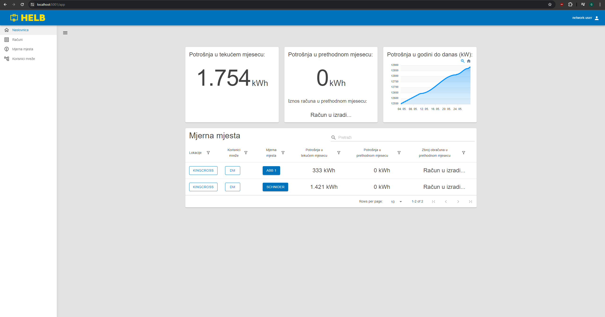
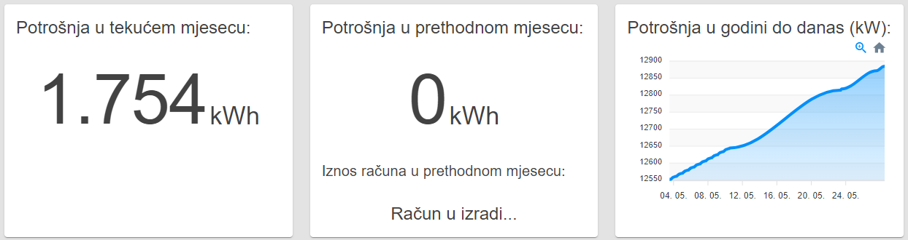
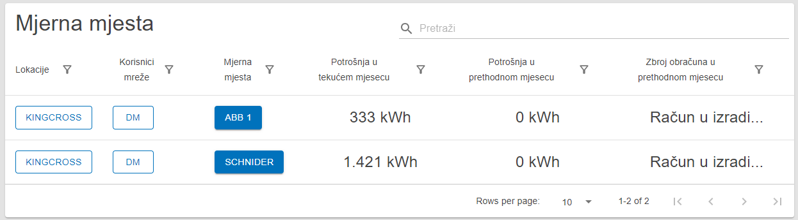

# Korisnik mreže

Nadzorna ploča za korisnika odabranog za nadgledanje korisnika mreže.

## Sadržaj

_/app_

## Početni panel korisnika mreže

Ovaj panel prikazuje tri segmenta koja pokazuju zbrojene vrijednosti potrošnje u
tekućem mjesecu, potrošnje u prethodnom mjesecu i ukupnih računa za prethodni
mjesec.

Također postoji grafikon koji prikazuje potrošnju energije ove godine.

_Početni panel korisnika mreže_

## Tablica mjernih mjesta

Ova tablica prikazuje sva mjerna mjesta koja trenutni korisnik može nadgledati.

Korisnik može vidjeti ime lokacije, korisnika mreže i uređaja na svakom mjernom
mjestu. Tablica također prikazuje potrošnju u tekućem mjesecu, potrošnju u
prethodnom mjesecu i zbroj računa za prethodni mjesec za ta mjerna mjesta.

Klikom na ime lokacije ili korisnika mreže, korisnik može pregledati detalje te
entitete.

Klikom na uređaj korisnik se preusmjerava na detaljan pregled pojedinačnih
mjernih mjesta.

 _Tablica
mjernih mjesta_
