# Ozds.Business

Ovaj projekt sadrži svu pozadinsku logiku poslužitelja. Ključne funkcije u ovom
projektu testiraju se u projektu `Ozds.Business.Test`. Logika je podijeljena u
imenske prostore konceptualno slične jedni drugima (npr. sva logika vezana uz
konverziju je u imenskom prostoru Conversion).

Za svaki imenski prostor prisutan je `Abstractions` imenski prostor koji sadrži
sučelja koja se trebaju koristiti u konzumirajućem kodu. Ako postoji imenski
prostor `Agnostic` , on se treba koristiti jer automatski rukuje logikom odabira
ispravne implementacije sučelja. Na primjer, `AgnosticModelEntityConverter` će
odabrati ispravnu implementaciju `IModelEntityConverter` na temelju vrste
entiteta ili modela.

## Ozds.Business.Aggregation

Ovaj imenski prostor sadrži logiku upserta agregacije na strani klijenta i
poslužitelja. Logika na strani poslužitelja koristi se za obavještavanje baze
podataka kako upsertati agregate putem LINQ izraza preko entiteta baze podataka,
a logika na strani klijenta oponaša to kao metodu preko poslovnih modela. Ako
bismo koristili samo logiku na strani poslužitelja, baza podataka bi se žalila
da ne može upsertati isti agregat dva puta u istoj transakciji. Zbog toga moramo
prvo upsertati agregate koji će biti umetnuti na strani klijenta, a zatim
upsertati agregate koji su na poslužitelju.

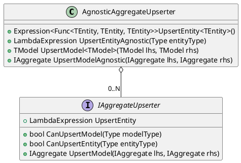

## Ozds.Business.Capabilities

Ovaj imenski prostor je WIP, ali će se koristiti za otkrivanje koje brojilo
mjeri koje mjere.

## Ozds.Business.Conversion

Ovaj imenski prostor sadrži konvertere za:

- Database entities &harr; business models

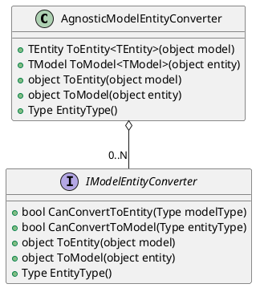

- Push requests &harr; measurement models

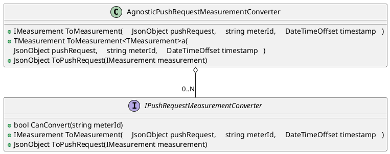

- Measurement models &rarr; aggregate models

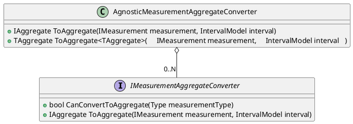

## Ozds.Business.Finance

Ovaj imenski prostor sadrži logiku naplate. Postoje tri razine izračuna naplate
potrebne za svaki račun:

- Razine računa: ovo je najviša razina koja odgovara korisniku mreže ili
  lokaciji i koristi niže razine za izračunavanje ukupnih i djelomičnih iznosa
  na računu

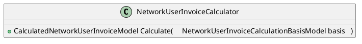

- Razine izračuna: svaki račun ima skup izračuna koji odgovaraju mjernom mjestu
  i koristi najnižu razinu za izračunavanje ukupnih i djelomičnih iznosa
  određenog izračuna

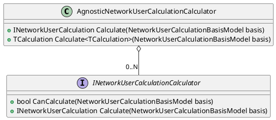

- Razine stavki izračuna: svaki izračun ima skup stavki izračuna koje odgovaraju
  određenoj stavki naplate i izračunava iznose i ukupne iznose određene stavke
  naplate

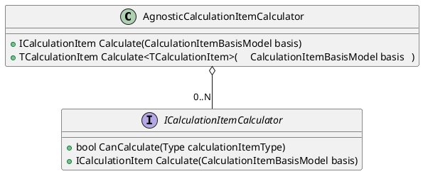

Za sada je implementiran samo izračun računa korisnika mreže.

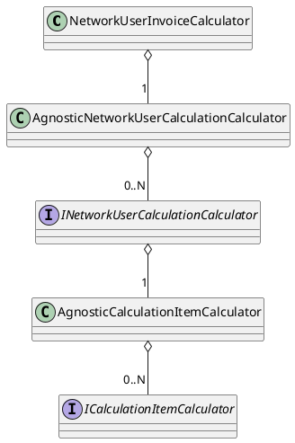

## Ozds.Business.Interceptors

Ovaj imenski prostor sadrži presretače za sve zahtjeve poslane bazi podataka i
implementira razne poslovne logike:

- `AggregateCreationInterceptor`: presreće svaki zahtjev bazi podataka koji
  sadrži mjerenja i stvara agregate za njih.
- `AuditingInterceptor`: presreće svaki zahtjev bazi podataka koji mijenja
  entitete koji se mogu revidirati, mijenja njihova revizijska polja i stvara
  revizijski događaj ovisno o vrsti promjene učinjene na entitetu.
- `CascadingSoftDeleteInterceptor`: ovaj presretač je WIP, ali je namijenjen za
  implementaciju logike mekog brisanja za entitete koji se mogu revidirati.
- `InvoiceIssuingInterceptor`: presreće svaki zahtjev za kreiranjem računa i
  mijenja polja izdavanja na tom računu.
- `ReadonlyInterceptor`: baca iznimku svaki put kada se pokuša promijeniti
  entitet koji je samo za čitanje.
- `ServedSaveChangesInterceptors`: ovo je osnovni tip za presretače koji se
  koristi za pružanje `IServiceProvider`.

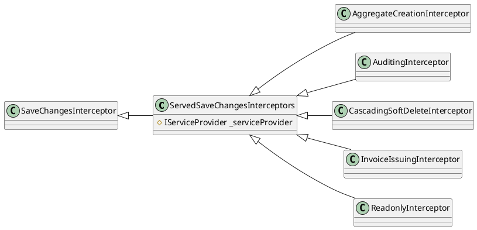

## Ozds.Business.Iot

Sadrži logiku za rukovanje IoT zahtjevima. Za sada rukuje samo slanjem
(`OzdsIotHandler`), ali će biti podijeljen na sučelje `Push` i `Poll` nakon što
implementiramo polling.

Slanje je proces u kojem IoT uređaji šalju mjerenja poslužitelju. Implementirano
je putem REST API-ja koji IoT uređaji mogu pozivati. IoT uređaji šalju mjerenja
koja se zatim agregiraju i pohranjuju u bazu podataka.

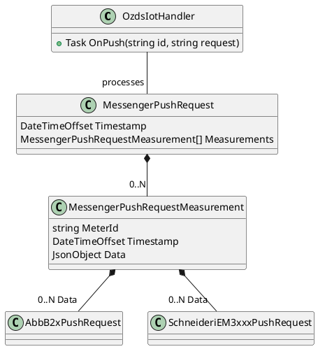

Polling je proces u kojem IoT uređaji traže od poslužitelja novije ažurirane
konfiguracije. Na taj način zaobilazimo potrebu za slanjem bilo čega IoT
uređajima što je problematično u današnjem internetu zbog tehnologija kao što je
CGNAT. Namijenjeno je da bude implementirano kao REST API koji IoT uređaji mogu
pozivati. IoT uređaji traže ažuriranu konfiguraciju, a poslužitelj odgovara
ažuriranom konfiguracijom iz baze podataka.

## Ozds.Business.Math

Sadrži logiku za manipulaciju električnim mjerenjima. Ovo je kritični dio
aplikacije na kojem se mnogo aplikacije oslanja i temeljito je testiran.

Postoje tri različite dimenzije koje svako mjerenje može imati:

- Faza: mjerenje može biti jednofazno ili trofazno mjerenje.

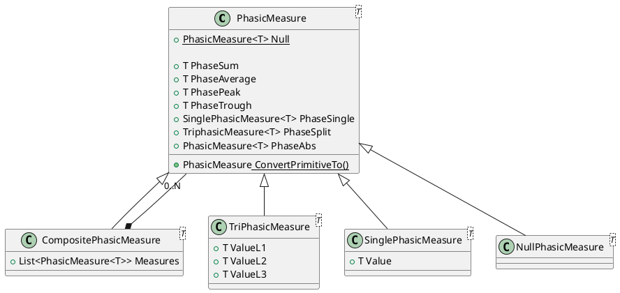

- Smjer: mjerenje može biti uvozno ili izvozno mjerenje, a to odgovara potrošnji
  i proizvodnji korisnika. Također može biti bilo koje dvostrano mjerenje ako je
  to mjerenje struje ili napona jer ta mjerenja nisu smjerna.

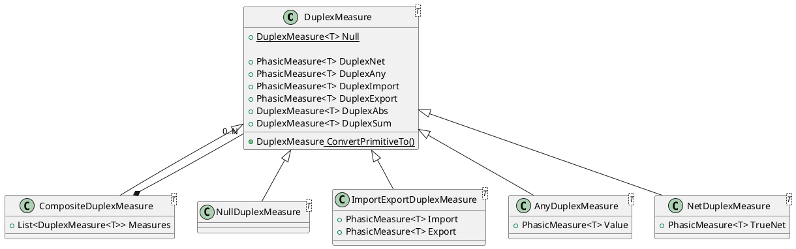

- Tarifa: mjerenje može biti visoka tarifa i niska tarifa ili jedinstveno
  tarifno mjerenje. Ovo se koristi za izračunavanje troškova mjerenja ovisno o
  dobu dana.

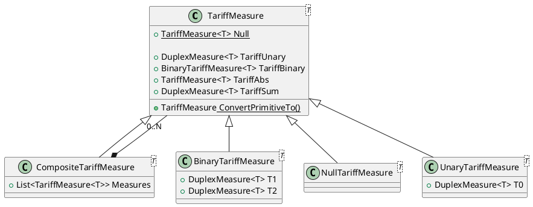

Struktura mjerenja je takva da klase hijerarhije tarifa sadrže klase hijerarhije
smjera koje sadrže klase hijerarhije faza. Sve tri ove hijerarhije klasa također
sadrže null klasu koja se koristi za predstavljanje mjerenja koje nije
postavljeno. Ove hijerarhije također sadrže kompozitnu klasu koja se koristi za
predstavljanje mjerenja koje je kombinacija dva ili više mjerenja. Ovo se
koristi za predstavljanje različitih načina na koje se mjerenje pohranjuje ili
izračunava radi veće točnosti. Na primjer, mogli bismo pohraniti mjerenje kao
tri faze, ali i kao jednu fazu, a za neke izračune jedno je točnije od drugog.

Postoje još dvije hijerarhije klasa najvišeg nivoa:

- Span: mjerenje može biti mjerenje tijekom određenog vremenskog razdoblja. Ovo
  se koristi za izračunavanje troškova tijekom vremenskog razdoblja.

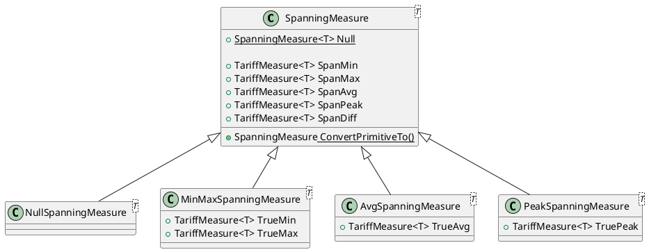

- Trošak: mjerenje može biti iznos korišten za izračunavanje troškova. Za
  izračune računa korisnika mreže to znači da se može koristiti za izračunavanje
  troškova opskrbe ili potrošnje i koristi se za predstavljanje ove dvije
  različite vrste troškova.

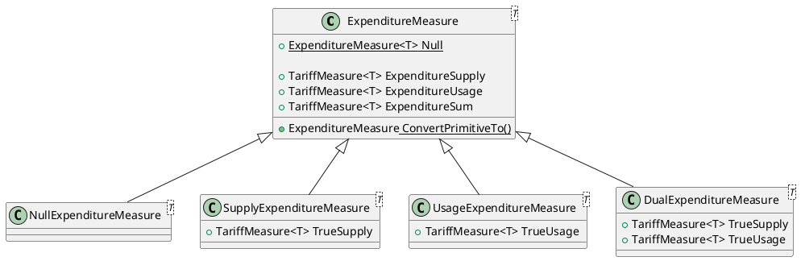

## Ozds.Business.Models

Sadrži poslovne modele koji se koriste za predstavljanje entiteta u bazi
podataka. Entiteti u bazi podataka predstavljeni su kao klase entiteta u
imenskom prostoru `Ozds.Data.Entities`, koji se zatim pretvaraju u poslovne
modele u ovom imenskom prostoru. Razlog za to je što klase entiteta baze
podataka imaju posebna polja ili svojstva koja upućuju Entity Framework Core
kako rukovati operacijama baze podataka koje ne bi trebale biti izložene ostatku
aplikacije. S druge strane, poslovni modeli imaju posebna polja i svojstva i
implementiraju sučelja koja ne bi trebala biti predstavljena u bazi podataka.

Postoji nekoliko marker sučelja koja se koriste za predstavljanje različitih
aspekata modela:

- Identifiable: modeli s identifikatorom. Osim toga, svi modeli koji se mogu
  identificirati trebaju imati naslov, što je lijep dodatak za njihovo
  prikazivanje u korisničkom sučelju.

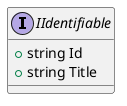

- Readonly: modeli koji su samo za čitanje i ne bi se trebali mijenjati.

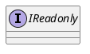

Modeli su podijeljeni u nekoliko hijerarhija klasa:

- Auditable: modeli koji se mogu revidirati. Svaki put kada se izvrši promjena
  na entitetu koji se može revidirati, stvara se revizijski događaj i ažuriraju
  se revizijska polja na entitetu.

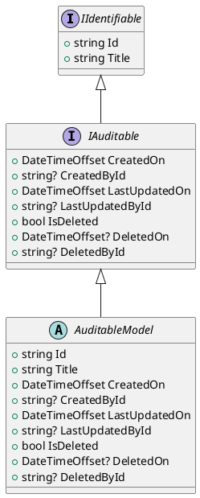

- Događaji: modeli koji predstavljaju događaje kao što je kada se entitet koji
  se može revidirati promijeni.

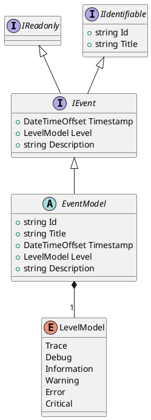

- Mjerenja: modeli koji predstavljaju mjerenja koja šalju IoT uređaji. Da bi se
  koristili modeli s više tipova uređaja, svi modeli mjerenja moraju
  implementirati različita svojstva mjerenja na `IMeasurement`.

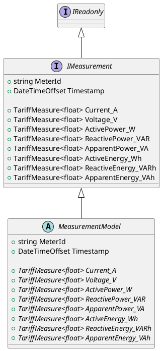

- Aggregates: modeli koji predstavljaju agregate mjerenja. Da bi se koristili
  modeli s više tipova uređaja, svi modeli agregata moraju implementirati
  različita svojstva mjerenja na `IAggregate`. `Timestamp` je uvijek početak
  raspona agregata. `Count`je broj mjerenja koja su agregirana. Non
  `SpanningMeasure` svojstva energije su vrijednosti posljednjeg mjerenja u
  rasponu, dok su non `SpanningMeasure` ne-energetska svojstva prosječne
  vrijednosti mjerenja u rasponu.

```plantuml
@startuml

interface IReadonly

interface IAggregate
{
  + string MeterId
  + DateTimeOffset Timestamp
  + IntervalModel Interval
  + long Count

  + TariffMeasure<float> Current_A
  + TariffMeasure<float> Voltage_V
  + TariffMeasure<float> ActivePower_W
  + TariffMeasure<float> ReactivePower_VAR
  + TariffMeasure<float> ApparentPower_VA
  + TariffMeasure<float> ActiveEnergy_Wh
  + TariffMeasure<float> ReactiveEnergy_VARh
  + TariffMeasure<float> ApparentEnergy_VAh

  + SpanningMeasure<float> ActiveEnergySpan_Wh
  + SpanningMeasure<float> ReactiveEnergySpan_VARh
  + SpanningMeasure<float> ApparentEnergySpan_VAh
}

abstract class AggregateModel
{
  + string MeterId
  + DateTimeOffset Timestamp
  + IntervalModel Interval
  + long Count

  + {abstract} TariffMeasure<float> Current_A
  + {abstract} TariffMeasure<float> Voltage_V
  + {abstract} TariffMeasure<float> ActivePower_W
  + {abstract} TariffMeasure<float> ReactivePower_VAR
  + {abstract} TariffMeasure<float> ApparentPower_VA
  + {abstract} TariffMeasure<float> ActiveEnergy_Wh
  + {abstract} TariffMeasure<float> ReactiveEnergy_VARh
  + {abstract} TariffMeasure<float> ApparentEnergy_VAh

  + {abstract} SpanningMeasure<float> ActiveEnergySpan_Wh
  + {abstract} SpanningMeasure<float> ReactiveEnergySpan_VARh
  + {abstract} SpanningMeasure<float> ApparentEnergySpan_VAh
}

IReadonly <|-- IAggregate
IAggregate <|-- AggregateModel

@enduml
```

- Računi: modeli koji predstavljaju račune koji se šalju korisnicima mreže.

```plantuml
@startuml

interface IReadonly

interface IIdentifiable
{
  + string Id
  + string Title
}

interface IInvoice
{
  + DateTimeOffset IssuedOn
  + string? IssuedById
  + DateTimeOffset FromDate
  + DateTimeOffset ToDate
  + decimal Total_EUR
  + decimal Tax_EUR
  + decimal TotalWithTax_EUR
}

abstract class InvoiceModel
{
  + string Id
  + string Title
  + DateTimeOffset IssuedOn
  + string? IssuedById
  + DateTimeOffset FromDate
  + DateTimeOffset ToDate
  + decimal Total_EUR
  + decimal Tax_EUR
  + decimal TotalWithTax_EUR
}

IReadonly <|-- IInvoice
IIdentifiable <|-- IInvoice
IInvoice <|-- InvoiceModel

@enduml
```

- Izračuni: modeli koji predstavljaju izračune koji se koriste za izračunavanje
  ukupnih i djelomičnih iznosa na računu.

```plantuml
@startuml

interface IReadonly

interface IIdentifiable
{
  + string Id
  + string Title
}

interface ICalculation
{
  + DateTimeOffset IssuedOn
  + string? IssuedById
  + DateTimeOffset FromDate
  + DateTimeOffset ToDate
  + string MeterId
  + IMeter Meter
  + decimal Total_EUR
}

abstract class CalculationModel
{
  + string Id
  + string Title
  + DateTimeOffset IssuedOn
  + string? IssuedById
  + DateTimeOffset FromDate
  + DateTimeOffset ToDate
  + string MeterId
  + IMeter ArchivedMeter
  + decimal Total_EUR
}

IReadonly <|-- ICalculation
IIdentifiable <|-- ICalculation
ICalculation <|-- CalculationModel

@enduml
```

Osim toga, sve hijerarhije klasa implementiraju `IValidatableObject`.

## Ozds.Business.Mutations

Sadrži klase koje obavijaju zahtjeve baze podataka u funkcije koje mijenjaju
podatke. Ovo su odvojene od drugih zahtjeva u `Ozds.Business.Queries` jer su
mutacije uvijek osjetljivije i treba ih pažljivo rukovati. Sve klase koriste
`AgnosticModelEntityConverter` iz `Ozds.Business.Conversion` za pretvaranje
mutiranih poslovnih modela u entitete baze podataka i `OzdsDbContext` iz
`Ozds.Data` za mijenjanje podataka u bazi podataka.

Većina mutacija se vrši putem agnostičkih klasa koje rade na hijerarhijama klasa
u `Ozds.Business.Models`:

- Auditable: mutacije koje mijenjaju entitete koji se mogu revidirati.

```plantuml
@startuml

class OzdsAuditableMutations
{
  - OzdsDbContext _context
  - AgnosticModelEntityConverter _modelEntityConverter

  + void Create(IAuditable)
  + void Update(IAuditable)
  + void Delete(IAuditable)
}

@enduml
```

- Događaji: mutacije koje mijenjaju događaje. Ova hijerarhija klasa je samo za
  čitanje, tako da je implementirana samo mutacija stvaranja.

```plantuml
@startuml

class OzdsEventMutations
{
  - OzdsDbContext _context
  - AgnosticModelEntityConverter _modelEntityConverter

  + void Create(IEvent)
}

@enduml
```

- Mjerenja: mutacije koje mijenjaju mjerenja. Ova hijerarhija klasa je samo za
  čitanje, tako da je implementirana samo mutacija stvaranja.

```plantuml
@startuml

class OzdsMeasurementMutations
{
  - OzdsDbContext _context
  - AgnosticModelEntityConverter _modelEntityConverter

  + void Create(IMeasurement)
}

@enduml
```

- Aggregates: mutacije koje mijenjaju agregate. Ova hijerarhija klasa je samo za
  čitanje, tako da je implementirana samo mutacija stvaranja.

```plantuml
@startuml

class OzdsAggregateMutations
{
  - OzdsDbContext _context
  - AgnosticModelEntityConverter _modelEntityConverter

  + void Create(IAggregate)
}

@enduml
```

- Računi: mutacije koje mijenjaju račune. Ova hijerarhija klasa je samo za
  čitanje, tako da je implementirana samo mutacija stvaranja.

```plantuml
@startuml

class OzdsInvoiceMutations
{
  - OzdsDbContext _context
  - AgnosticModelEntityConverter _modelEntityConverter

  + void Create(IInvoice)
}

@enduml
```

- Izračuni: mutacije koje mijenjaju izračune. Ova hijerarhija klasa je samo za
  čitanje, tako da je implementirana samo mutacija stvaranja.

```plantuml
@startuml

class OzdsCalculationMutations
{
  - OzdsDbContext _context
  - AgnosticModelEntityConverter _modelEntityConverter

  + void Create(ICalculation)
}

@enduml
```

## Ozds.Business.Queries

Sadrži klase koje obavijaju zahtjeve baze podataka u funkcije koje upituju
podatke. Ovo su odvojene od drugih zahtjeva u `Ozds.Business.Mutations` jer su
upiti uvijek manje osjetljivi i treba ih rukovati s manje pažnje. Sve klase
koriste `OzdsDbContext` iz `Ozds.Data` za upite podataka u bazi podataka i
`AgnosticModelEntityConverter` iz `Ozds.Business.Conversion` za pretvaranje
upitanih entiteta baze podataka u poslovne modele.

Klase upita koriste klasu `PaginatedList<T>` koja olakšava paginaciju rezultata
upita.

```plantuml
@startuml

class PaginatedList<T>
{
  + List<T> Items
  + int TotalCount
}

@enduml
```

Klase upita također koriste `Z.EntityFramework.Plus.EFCore` nuget paket za
izradu where i order by klauzula agnostičkih prema vrsti entiteta. Ovo čini kod
krhkijim, ali za sada je to brzo i prljavo rješenje za početak prije nego što
sve pretvorimo u korištenje standardnih LINQ izraza.

ećina upita se vrši putem specifično implementiranih klasa, ali se mnogo može
upitati putem agnostičkih klasa koje rade na hijerarhijama klasa u
`Ozds.Business.Models`:

- Auditable: upiti koji upituju entitete koji se mogu revidirati.

```plantuml
@startuml

class OzdsAuditableQueries
{
  - OzdsDbContext _context
  - AgnosticModelEntityConverter _modelEntityConverter

  + Task<T?> ReadSingle<T>(string id) where T : class, IAuditable
  + Task<PaginatedList<T>> Read<T>( \
    IEnumerable<string> whereClauses, \
    IEnumerable<string> orderByDescClauses, \
    IEnumerable<string> orderByAscClauses, \
    int pageNumber = QueryConstants.StartingPage, \
    int pageCount = QueryConstants.DefaultPageCount \
  ) where T : class, IAuditable
}

@enduml
```

- Događaji: upiti koji upituju događaje.

```plantuml
@startuml

class OzdsEventQueries
{
  - OzdsDbContext _context
  - AgnosticModelEntityConverter _modelEntityConverter

  + public async Task<PaginatedList<T>> Read<T>( \
    IEnumerable<string> whereClauses, \
    DateTimeOffset fromDate, \
    DateTimeOffset toDate, \
    int pageNumber = QueryConstants.StartingPage, \
    int pageCount = QueryConstants.DefaultPageCount \
  ) where T : class, IEvent
}

@enduml
```

- Mjerenja: upiti koji upituju mjerenja.

```plantuml
@startuml

class OzdsMeasurementQueries
{
  - OzdsDbContext _context
  - AgnosticModelEntityConverter _modelEntityConverter

  + Task<PaginatedList<T>> Read<T>( \
    IEnumerable<string> whereClauses, \
    DateTimeOffset fromDate, \
    DateTimeOffset toDate, \
    int pageNumber = QueryConstants.StartingPage, \
    int pageCount = QueryConstants.DefaultPageCount \
  ) where T : class, IMeasurement
}

@enduml
```

- Aggregates: upiti koji upituju agregate.

```plantuml
@startuml

class OzdsAggregateQueries
{
  - OzdsDbContext _context
  - AgnosticModelEntityConverter _modelEntityConverter

  + Task<PaginatedList<T>> Read<T>( \
    IEnumerable<string> whereClauses, \
    DateTimeOffset fromDate, \
    DateTimeOffset toDate, \
    int pageNumber = QueryConstants.StartingPage, \
    int pageCount = QueryConstants.DefaultPageCount \
  ) where T : class, IAggregate
}

@enduml
```

- Računi: upiti koji upituju račune.

```plantuml
@startuml

class OzdsInvoiceQueries
{
  - OzdsDbContext _context
  - AgnosticModelEntityConverter _modelEntityConverter

  + Task<T?> ReadSingle<T>(string id) where T : class, IInvoice
  + Task<PaginatedList<T>> Read<T>( \
    IEnumerable<string> whereClauses, \
    IEnumerable<string> orderByDescClauses, \
    IEnumerable<string> orderByAscClauses, \
    int pageNumber = QueryConstants.StartingPage, \
    int pageCount = QueryConstants.DefaultPageCount \
  ) where T : class, IInvoice
}

@enduml
```

- Izračuni: upiti koji upituju izračune.

```plantuml
@startuml

class OzdsCalculationQueries
{
  - OzdsDbContext _context
  - AgnosticModelEntityConverter _modelEntityConverter

  + Task<T?> ReadSingle<T>(string id) where T : class, ICalculation
  + Task<PaginatedList<T>> Read<T>( \
    IEnumerable<string> whereClauses, \
    IEnumerable<string> orderByDescClauses, \
    IEnumerable<string> orderByAscClauses, \
    int pageNumber = QueryConstants.StartingPage, \
    int pageCount = QueryConstants.DefaultPageCount \
  ) where T : class, ICalculation
}

@enduml
```

## Ozds.Business.Time

Sadrži svu logiku za rukovanje vremenom. Ovo je kritični dio aplikacije na kojem
se mnogo aplikacije oslanja i temeljito je testiran.
