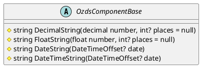

# Ozds.Client

Ovaj projekt sadrži sve UI stranice i višekratne komponente potrebne za
prikazivanje korisničkog sučelja. Stranice se nalaze u imenskom prostoru
`Pages`, a višekratne komponente se nalaze u imenskom prostoru `Shared`.
Stranice u imenskom prostoru `Pages` su minimalne složenosti, sadrže samo jednu
rutu, a većina UI logike je smještena u višekratne komponente. Višekratne
komponente sadrže samo UI logiku, dok je sva logika pozadinskog sustava
smještena u projektu `Ozds.Business`.

## Ozds.Client.Base

Sadrži osnovne komponente i klase komponenti za izgled korisničkog sučelja. Ove
klase pružaju funkcije koje olakšavaju serijalizaciju datuma, mjerenja i
lokalizaciju teksta.

## Ozds.Client.Pages

Sadrži stranice koje prikazuje korisničko sučelje. Stranice su bolje objašnjene
u drugim dijelovima dokumentacije.

## Ozds.Client.Shared

Sadrži višekratne komponente. Višekratne komponente su raspoređene u više
imenskih prostora, svaki za različitu svrhu:

- Models: sadrži komponente izravno povezane s pojedinačnim modelima u projektu
  `Ozds.Business`. Ove komponente se koriste za pregledavanje i potencijalno
  uređivanje i reviziju modela.

- Print: sadrži komponente koje se koriste za prikazivanje PDF dokumenata. Za
  sada sadrže samo komponente koje se koriste za prikazivanje računa.

- Layout: sadrži komponente koje se koriste za prikazivanje izgleda korisničkog
  sučelja. Ove komponente se koriste za prikazivanje zaglavlja, podnožja i
  drugih uobičajenih dijelova korisničkog sučelja.
