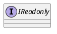
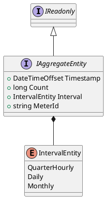
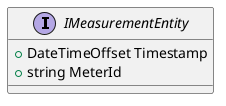
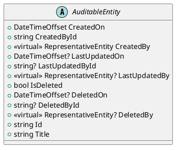
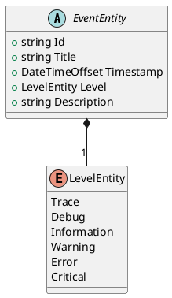
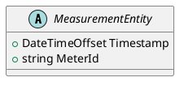
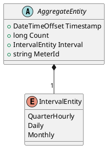
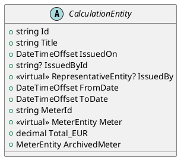
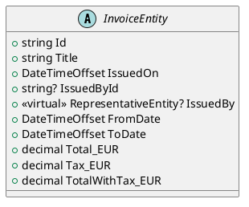

# Ozds.Data

Ovaj projekt sadrži sve entitete i upite za bazu podataka. Entiteti se nalaze u
imenskom prostoru `Entities`, a upiti su funkcije u klasi `OzdsDbClient`. Klasa
je djelomična i podijeljena je u konceptualno slične datoteke (npr. svi upiti za
brojila su u datoteci OzdsDbClientMeters.cs).

## Shema

[The schema](../../schema.md) se generira korištenjem `mermerd` kada se migrira
na najnoviju migraciju generiranu pomoću `dotnet ef`.

## Ozds.Data.Entities

Sadrži entitete koji se koriste za predstavljanje tablica u bazi podataka.

Postoji nekoliko marker sučelja koja se koriste za implementaciju određene
funkcionalnosti ili presretača u `Ozds.Business`:

- Readonly: marker sučelje koje se koristi za implementaciju entiteta samo za
  čitanje bacanjem iznimki pri mutacijama

- Aggregate: marker sučelje koje se koristi za implementaciju agregacije
  mjerenja. Za sada se mjerenja agregiraju u četvrt-satnim, dnevnim i mjesečnim
  intervalima.

- Measurement: marker sučelje koje se koristi za implementaciju agregacija
  mjerenja.

Osim marker sučelja, entiteti se mogu grupirati u nekoliko hijerarhija klasa.
Virtualna svojstva na klasama entiteta su navigacijska svojstva prema drugim
entitetima s kojima imaju odnos i nisu pohranjena u bazi podataka. Ove
hijerarhije olakšavaju grupiranje entiteta koji imaju slične mape prema
tablicama baze podataka:

- Auditable: entiteti koji se mogu revidirati. Ovi entiteti također imaju
  funkcionalnost mekog brisanja implementiranu putem presretača.

- Event: entiteti koji predstavljaju događaje.

- Measurements: entiteti koji predstavljaju mjerenja. Konkreti tipovi mjerenja
  imaju navigacijska svojstva prema specifičnim tipovima brojila.

- Aggregates: entiteti koji predstavljaju agregirana mjerenja. Vremenski žig je
  početak intervala, a broj je broj mjerenja u tom intervalu. Konkreti tipovi
  agregata imaju navigacijska svojstva prema specifičnim tipovima brojila.

- Calculations: entiteti koji predstavljaju izračune. Izračuni koji nemaju
  izdavatelja su automatski izdani od strane poslužitelja.

- Invoices: entiteti koji predstavljaju račune.

## Ozds.Data.Migrations

Ovaj imenski prostor sadrži generirane migracije za bazu podataka. Migracije se
generiraju korištenjem `dotnet ef` i nalaze se u direktoriju `Migrations`.
