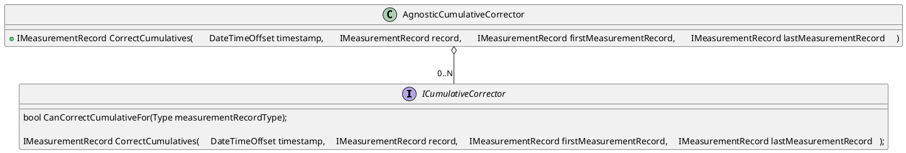
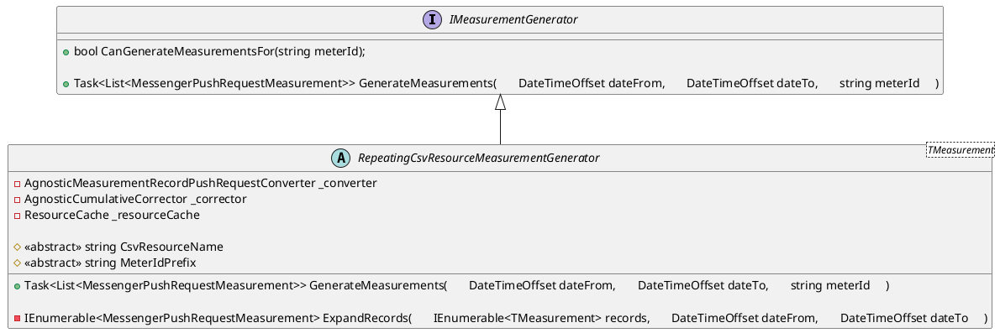
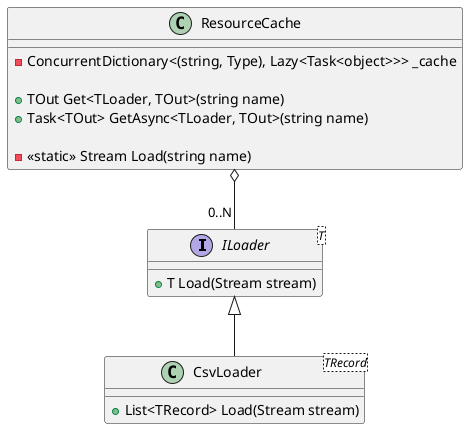
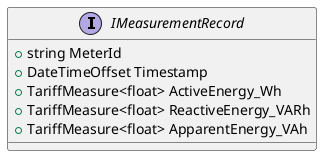

# Ozds.Fake

<!-- TODO: expand verbs in files and add altibiz -->

Ovo je projekt namijenjen isključivo za razvojne svrhe. Tretira se kao skripta
koja šalje mjerenja na razvojnu instancu `Ozds.Server` . Ima dva glavna načina
rada:

- `push`: kontinuirano šalje mjerenja na poslužitelj iz CSV datoteke. Ovisno o
  zatraženom ID-u brojila, odabrat će CSV datoteku koja odgovara tom tipu
  brojila i poslati mjerenja na poslužitelj. CSV datoteke se učitavaju kao
  ugrađeni resursi iz `Assets`, ali se prate putem `DVC`. CSV datoteke imaju
  proizvoljan broj mjerenja u proizvoljnom vremenskom intervalu, a `Ozds.Fake`
  to ispravlja za trenutnu vremensku točku.

- `seed`: popunjava bazu podataka slanjem mjerenja kao što bi to obično činilo s
  `push`, ali za zatraženi vremenski interval odmah u velikim serijama. Ovaj
  način rada traje neko vrijeme ovisno o intervalu, ali je vrijedan čekanja
  ovisno o scenariju testiranja.

Projekt ima sličnu strukturu imenskih prostora kao `Ozds.Business` i referencira
ga kako bi oponašao strukturu podataka API-ja potrebnu za slanje mjerenja.

## Ozds.Fake.Client

Sadrži klijent koji šalje mjerenja na poslužitelj. Sadrži jednu klasu s jednom
metodom koja šalje HTTP zahtjeve na poslužitelj.

## Ozds.Fake.Correction

Logika ispravljanja prilikom pretvaranja CSV zapisa u mjerenja. Do sada je
potrebna i implementirana samo ispravka kumulativnih mjera putem sučelja
`ICumulativeCorrector` i klasa koje ga implementiraju.

## Ozds.Fake.Generators

Logika generiranja mjerenja za push zahtjeve. Generatori deserializiraju CSV
zapise, ispravljaju kumulative i generiraju mjerenja za push zahtjeve unutar
zadanog vremenskog intervala. Razlog zašto generatori rade sve ovo je zato što
je za ispravljanje kumulativa i generiranje mjerenja za push zahtjeve potrebno
znanje o cijelom skupu podataka. Do sada su potrebni i implementirani samo
generatori ponavljajućih CSV datoteka.

## Ozds.Fake.Loaders

Loaderi za različite tipove ugrađenih resursa. Trenutno je potreban i
implementiran samo loader za CSV datoteke. Ovi loaderi se zatim koriste od
strane `ResourceCache` koji kešira učitane resurse. U slučaju CSV datoteka,
učitani resurs je popis zapisa.

## Ozds.Fake.Records

Sadrži CSV klase zapisa koje se koriste za deserializaciju CSV datoteka i
ispravljanje kumulativnih mjera. Sve konkretne klase implementiraju sučelje
`IMeasurementRecord`.

