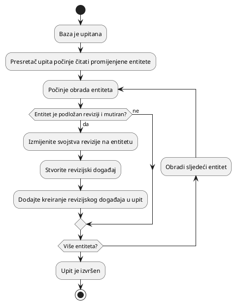

# Revizija

Revizija je proces praćenja promjena na podacima koji se mogu revidirati, poput
lokacija i korisnika mreže, putem revizijskih događaja. Revizijske događaje
stvara poslužitelj svaki put kada se podaci koji se mogu revidirati kreiraju,
ažuriraju ili brišu. Ovi događaji se pohranjuju u bazu podataka i mogu se
pretraživati kako bi se odredilo tko je napravio promjenu, kada je promjena
napravljena i koja je promjena bila.

Revizija se provodi putem presretača upita koji stvara revizijski događaj svaki
put kada se podaci koji se mogu revidirati kreiraju, ažuriraju ili brišu.

