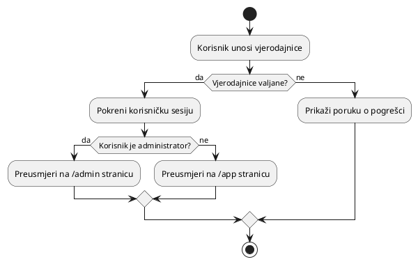

# Prijava

Prijava je jednostavan tijek rada koji započinje korisničku sesiju i usmjerava
korisnika na ispravnu stranicu ovisno o njihovoj ulozi. Postoje dvije vrste
korisnika koje tijek prijave razlikuje: administratori i obični korisnici.
Administratori (uglavnom programeri) preusmjeravaju se na administrativnu
stranicu, dok se obični korisnici preusmjeravaju na stranicu aplikacije.

