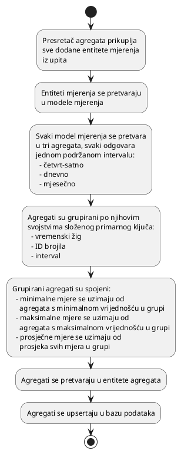

# Slanje

Messengeri šalju mjerenja s brojila putem `push` API-ja na poslužitelj.

Proces umetanja mjerenja je prilično jednostavan jer zahtijeva samo
deserializaciju JSON-a i mapiranje modela mjerenja na entitete baze podataka
mjerenja prije nego što umetanje može započeti.

Komplikovani dio je stvaranje agregata preko mjerenja. Svjesni smo da
`TimescaleDB` ima značajku kontinuiranih agregata koja se može koristiti za
automatsko izvođenje ovog procesa u bazi podataka, no to zahtijeva `TimescaleDB`
licencu zajednice koja nije dostupna u Azure cloudu. Stoga smo implementirali
presretač upita koji prvo pretvara mjerenja u agregate, spaja ih na
poslužitelju, a zatim ih upserta u bazu podataka. Proces spajanja je potreban
jer agregati imaju složeni primarni ključ koji se sastoji od njihovog vremenskog
žiga, ID-a brojila i intervala, što znači da bez spajanja na poslužitelju, više
instanci istog agregata može biti prisutno u jednom upitu, što nije dopušteno.

Postoji jedan veliki nedostatak našeg pristupa. Budući da
`Entity Framework Core` još ne podržava upserte, morali smo koristiti zasebnu
biblioteku za to. Biblioteka koju koristimo za upserte u bazi podataka ne
podržava upsert u istom upitu kao umetanje mjerenja. To znači da svako slanje
mjerenja rezultira s dva upita prema bazi podataka. Jedan za umetanje mjerenja i
jedan za upsert agregata. Ovo nije idealno, ali je najbolje što smo mogli
učiniti s trenutnim stanjem biblioteka koje koristimo.

