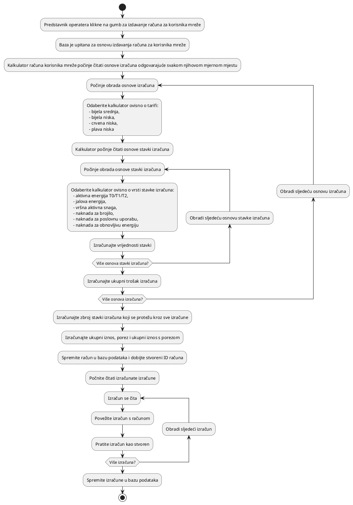

# Naplata

<!-- FIXME: messaging -->

Naplata je proces izdavanja računa korisnicima mreže i lokacijama. Trenutno je
implementirana samo naplata za korisnike mreže. Operateri trenutno mogu izdavati
račune na zahtjev za posljednje obračunsko razdoblje (prošli mjesec).

Naplata se provodi putem skupa klasa koje izračunavaju različite dijelove računa
ovisno o mjernim mjestima i tarifama.

