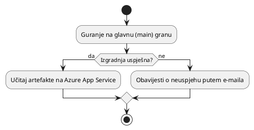

# Implementacija

Implementacija se vrši putem GitHub Actions. Workflow za implementaciju
definiran je u `.github/workflows/deploy.yml`. Workflow se pokreće pri guranju
(push) na `main` granu. Workflow gradi OZDS web aplikaciju i učitava je na Azure
App Service.

