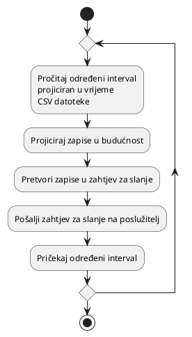
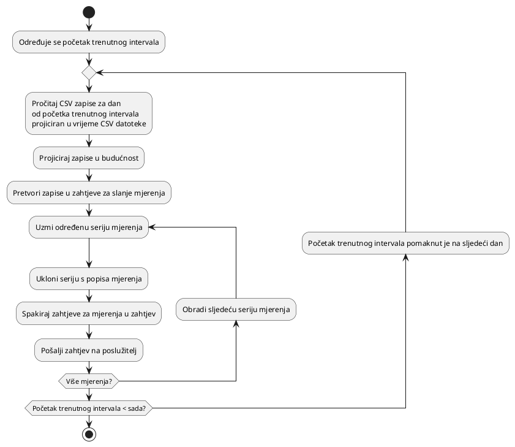

# Lažiranje

Lažiranje mjerenja se vrši u dva načina: slanjem i sjemenjenjem. U načinu
slanja, mjerenja se kontinuirano lažiraju i šalju na poslužitelj. U načinu
sjemenjenja, mjerenja se lažiraju za određeni interval (npr. prošli tjedan) i
šalju na poslužitelj u velikim serijama što je brže moguće.

## Slanje

Slanje je kontinuirani proces koji šalje mjerenja na poslužitelj svakog
određenog intervala (npr. zadnja minuta) za mjerenja u tom intervalu. Zatraženi
interval se prvo projicira u vrijeme CSV datoteke, a zatim se zapisi projiciraju
u budućnost.

## Sjemenjenje

Sjemenjenje je jednokratna operacija koja šalje mjerenja na poslužitelj za
određeni interval (npr. prošli tjedan) u velikim serijama što je brže moguće. To
se postiže na isti način kao i slanje, ali se zahtjevi šalju jednom bez čekanja
na sljedeći interval.

