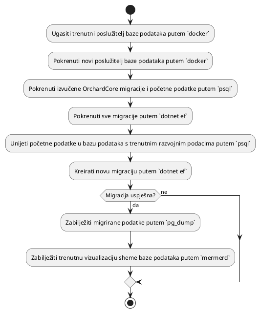

# Migracija

Migracije se generiraju putem `dotnet ef`, ali za pripremu baze podataka i
provjeru jesu li migracije prošle dobro, potrebno je učiniti malo više.

```plantuml
@startuml

start

:Ugasiti trenutni poslužitelj baze podataka putem `docker`;

:Pokrenuti novi poslužitelj baze podataka putem `docker`;

:Pokrenuti izvučene OrchardCore migracije i početne podatke putem `psql`;

:Pokrenuti sve migracije putem `dotnet ef`;

:Unijeti početne podatke u bazu podataka s trenutnim razvojnim podacima putem `psql`;

:Kreirati novu migraciju putem `dotnet ef`;

if (Migracija uspješna?) then (da)
  :Zabilježiti migrirane podatke putem `pg_dump`;

  :Zabilježiti trenutnu vizualizaciju sheme baze podataka putem `mermerd`;
else (ne)
endif

stop

@enduml
```
