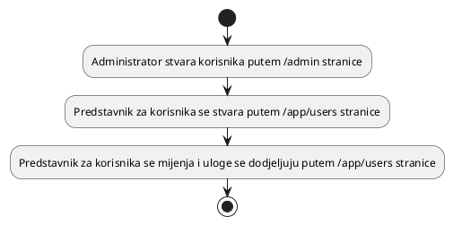

# Moderacija

Moderacija, u kontekstu OZDS-a, je čin upravljanja korisnicima, uključujući
stvaranje i izmjenu korisnika. Za sada, administrator je potreban za stvaranje
korisnika, a zatim podatke o korisniku mogu mijenjati drugi korisnici. To je
zato što koristimo OrchardCore za upravljanje korisnicima i najjednostavniji
način je bio koristiti OrchardCore UI za stvaranje korisnika, a zatim povezati
našu tablicu predstavnika s OrchardCore tablicama korisnika u bazi podataka. U
budućnosti, nastojimo pojednostaviti ovaj proces putem registracije i
autorizacije specifičnih korisnika koji stvaraju druge korisnike.

